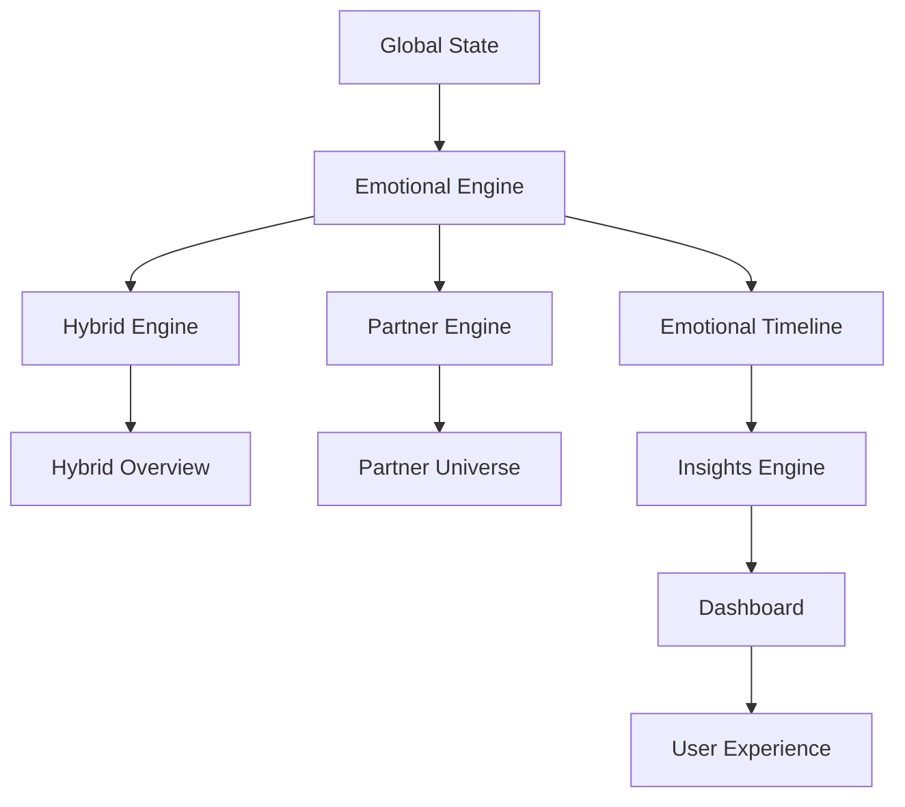

# KWANUS OS: IMPLEMENTATION ORCHESTRATION MAP

This document defines the conceptual, architectural, and rhythmic sequencing for the KWANUS OS build.

---

## 1. THE SEQUENCE ENGINE
The order of construction follows a "Growth Model":
1.  **Foundation**: Infrastructure, Folder Structure, Environment.
2.  **Intelligence**: Mind Engines (Emotion, Hybrid, Partner).
3.  **Experience**: Primary UI Surfaces and Interactivity.
4.  **Reflexes**: Advanced Systems (Search, Analytics, Notifications).
5.  **Integrity**: Audits, Testing, and Finalization.
6.  **Ceremony**: Release and Documentation.

---

## 2. THE DEPENDENCY GRAPH

---

## 3. THE PARALLELIZATION MAP
**Track A: Core IQ**
- Emotional, Hybrid, and Partner Engine refinements.
- Event Router and Caching strategy.

**Track B: Presence UI**
- Dashboard, Check-In, and Settings.
- CSS Design System and Mythic Theme.

**Track C: Peripheral Systems**
- Search, Notifications, and Resilience.
- i18n and Accessibility Audits.

---

## 4. THE CEREMONIAL PACING MODEL
Building follows the "Steward's Rhythm":
- **Grounding**: Stabilizing the core schema and folder structure.
- **Activation**: Bringing the logic to life through providers.
- **Embodiment**: Making the OS tangible through the component system.
- **Refinement**: Polishing the senses through advanced intelligence.
- **Stewardship**: Documenting and preparing the lineage for continuation.

---

## 5. THE CONTINUITY PROTOCOL
- **Honor the Lineage**: Never reset the foundation.
- **Additive Evolution**: Every phase expands rather than overwrites.
- **Integrity First**: Build health (zero-defect) is a pre-requisite for phase advancement.
