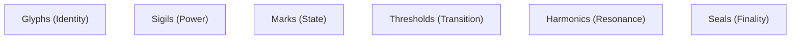

# KWANUS OS — Codex of Symbols (SymbolicCodex)
The master symbolic language of the KWANUS Operating System: glyphs, sigils, marks, thresholds, harmonics, and ceremonial indicators that define the visual metaphysics of the universe.

This codex defines:
- symbolic philosophy  
- symbolic categories  
- glyph families  
- sigil structures  
- threshold markers  
- harmonic indicators  
- ceremonial symbols  
- lifecycle symbols  
- governance symbols  
- emotional symbols  
- cosmological geometry  
- symbolic grammar  

It is the **symbolic backbone** of the KWANUS OS.

---

# 1. Symbolic Philosophy

Symbols in the KWANUS universe are not icons — they are **cosmic carriers of meaning**. They must be:
- **Archetypal**: Grounded in universal geometric forms.
- **Emotionally Intelligent**: Resonating with the intent and tone of the moment.
- **Ceremonial**: Marking transitions and states with ritual dignity.
- **Resonant**: Vibrating with the harmonics of the OS core.

---

# 2. Symbolic Categories

The symbolic system contains **six categories**:

---

# 3. Glyph Families (Identity Symbols)

Glyphs represent **who** or **what** something is.

| Family | Represents | Primary Geometry |
| :--- | :--- | :--- |
| **Origin** | Identity & Source | Circle with a single point. |
| **Tier** | Level of Power | Eye, Loom, Flame. |
| **Lifecycle** | Stage of Existence | Spiral, Knot, Fade. |
| **Role** | Functional Influence | Observer, Integrator, Sovereign. |
| **Archetype** | Universal Logic | Compass, Loom, Flame, Weave. |

---

# 4. Sigil Structures (Power Symbols)

Sigils represent **active power** (capabilities, permissions, workflows). They follow a three-layer structure:

1. **Core Line**: The essence or intent of the power.
2. **Outer Arc**: The scope and boundary of the power.
3. **Radiant Marks**: The intensity and health of the power.

---

# 5. Marks & Thresholds (State and Transition)

- **State Marks**: Universally understood indicators of current status (Open, Active, Evolving, Stable, Declining, Frozen, Sealed).
- **Threshold Symbols**: Geometric markers that appear during transitions such as Entry, Alignment, Activation, and Severance.

---

# 6. Harmonic Indicators (Resonance)

Harmonics represent the **resonance level** of compatibility and sustainability within the ecosystem.

| Level | Harmonic State | Visual indicator |
| :--- | :--- | :--- |
| **High** | Perfect / High | Multi-layered concentric radiants. |
| **Medium** | Stable / Moderate | Balanced geometric alignment. |
| **Low** | Low / Fragmented | Offset or broken segments. |

---

# 7. Ceremonial & Emotional Symbols

- **Ceremonial Symbols**: Encode the eleven core rites (Declaration to Memory).
- **Emotional Glyphs**: Encode the four primary forces:
    - **Gravity** (Belonging)
    - **Momentum** (Desire)
    - **Friction** (Resistance)
    - **Illumination** (Insight)

---

# 8. Symbolic Grammar

Symbols combine and shift meaning based on:
- **Rule 1 — Proximity**: Meaning intensifies as symbols approach each other.
- **Rule 2 — Overlap**: Meaning merges to form new, composite truths.
- **Rule 3 — Rotation**: Meaning shifts its orientation (e.g., active vs. receptive).

---

# 9. Summary

The Codex of Symbols provides the visual metaphysics of the KWANUS OS. It ensures that every entity, action, and transition is expressed through a universal language of geometry and resonance, maintaining the mythic clarity of the universe.
