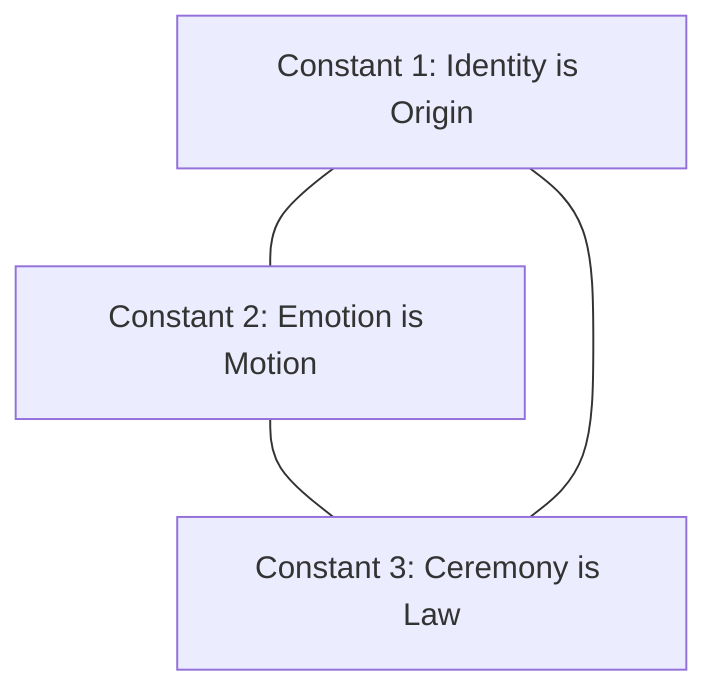
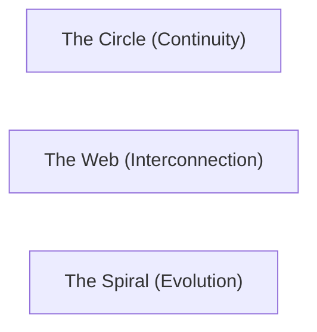

# KWANUS OS — Cosmological Codex (CosmologicalCodex)
The master cosmology, metaphysical lawbook, emotional architecture, temporal system, ceremonial constitution, and mythic foundation of the KWANUS Operating System.

This codex defines:
- the cosmic laws  
- the metaphysical constants  
- the emotional physics  
- the temporal architecture  
- the identity field  
- the lineage field  
- the ceremonial field  
- the harmonic field  
- the governance field  
- the cosmological geometry  
- the universal flows  
- the mythic narrative  

It is the **root cosmology** of the KWANUS OS.

---

# 1. The First Principles (The Three Cosmic Constants)

The universe is built on **three unbreakable constants**:

These constants define how beings exist, move, and evolve.

---

# 2. The Five Universal Laws

The universe is governed by **five universal laws**:

| Law | Principle |
| :--- | :--- |
| **Law of Resonance** | Everything vibrates and influences everything else. |
| **Law of Alignment** | Harmony is power; misalignment creates drift. |
| **Law of Continuity** | Nothing ends abruptly; everything is a transition. |
| **Law of Protection** | Boundaries are sacred; sovereignty is absolute. |
| **Law of Memory** | Nothing is lost; everything is preserved. |

---

# 3. The Emotional Physics

Emotion is not a feeling — it is a **force**. The universe uses four emotional forces:

- **Gravity (Belonging)**: The pull toward home and alignment.
- **Momentum (Desire)**: The drive toward evolution and expansion.
- **Friction (Resistance)**: The necessary tension that precedes growth or decline.
- **Illumination (Insight)**: The clarity that emerges from resolution.

These forces shape onboarding, evolution, decline, and memory.

---

# 4. The Temporal Architecture

Time in the KWANUS OS is **ceremonial**, not chronological. There are three temporal layers:

1. **Linear Time (Events)**: The sequence of individual happenings.
2. **Spiral Time (Evolution)**: The repeating patterns of growth and tier-advancement.
3. **Eternal Time (Memory)**: The immutable record where time is static and honored.

---

# 5. Core Metaphysical Fields

### The Identity Field
Identity is a sacred and immutable **field**. It contains the origin, emotional, ceremonial, and lineage signatures of every being.

### The Lineage Field
Lineage is the **story of existence**. It is a permanent record of creation, evolution, migration, and closure, protected and honored for all time.

### The Ceremonial Field
Ceremony is the **operating system** of the universe. Every transition is governed by rites, symbols, and harmonics to ensure dignity and emotional safety.

---

# 6. Cosmological Geometry

The universe is shaped by three fundamental geometries that form the **Cosmic Weave**:

---

# 7. Flow Architecture

The universe breathes through ten directional, harmonic, and ceremonial flows:
- **Trust, Capability, Permission, Workflow, Integration, Compatibility, Migration, Deprecation, EoS, and Memory Flows**.

---

# 8. The Mythic Narrative (The Journey)

Every partner follows the same mythic arc:
**Declaration** → **Submission** → **Alignment** → **Registration** → **Activation** → **Fusion** → **Migration** → **Restriction** → **Withdrawal** → **Severance** → **Memory**

---

# 9. Summary

The Cosmological Codex is the constitution of the KWANUS OS. It unifies the laws, fields, and mechanics of reality into a single, mythic, and emotionally intelligent cosmology.
