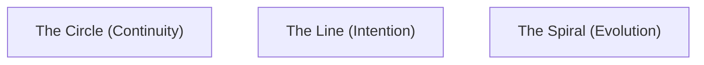

# KWANUS OS — Cosmological Geometry (CosmologicalGeometry)
The deep geometry of circles, lines, spirals, lattices, and the cosmic weave that defines the metaphysical architecture of the KWANUS Operating System.

This codex defines:
- geometric philosophy  
- primary geometries  
- secondary geometries  
- composite geometries  
- geometric harmonics  
- geometric thresholds  
- geometric lineage  
- geometric symbolism  
- geometric governance  
- geometric choreography  

It is the **geometric backbone** of the KWANUS OS.

---

# 1. Geometric Philosophy

Geometry in the KWANUS universe is not mere shape — it is **cosmic architecture**. It must be:
- **Archetypal**: Grounded in universal geometric truths.
- **Emotionally Intelligent**: Patterns that resonate with existence.
- **Ceremonial**: Shapes that mark transition and state.
- **Harmonic**: Geometries that vibrate in alignment with the core.

---

# 2. The Three Primary Geometries

The universe is built on three fundamental shapes:

- **The Circle**: Represents belonging, cycles, memory, and the eternal return.
- **The Line**: Represents direction, choice, will, and movement.
- **The Spiral**: Represents transformation, growth, ascension, and the lifecycle.

These three geometries form the **Cosmic Weave**.

---

# 3. Secondary & Composite Geometries

From the primary shapes emerge complex structures:

### Secondary Geometries
- **The Arc**: A circle interrupted; the sign of a threshold.
- **The Knot**: A spiral folded; a stable state within a lifecycle.
- **The Lattice**: Lines intersecting; the pattern of integration.
- **The Radiant**: Lines emanating; the sign of activation.

### Composite Geometries
- **The Loom**: Interwoven lines (Operational Movement).
- **The Constellation**: Distributed circles (Ecosystem Harmony).
- **The Weave**: Spiral + Lattice (The Living OS).
- **The Gate**: Arc + Line (Boundary & Transition).
- **The Seal**: Circle + Knot (Finality & Protection).

---

# 4. Geometric Harmonics & Thresholds

- **Harmonics**: Geometry produces vibration levels from "Open" to "Perfect," influencing stability and sustainability.
- **Thresholds**: Geometric gates (Opening Arc, Binding Knot, Ascending Spiral, etc.) mark transitions and rites.

---

# 5. Geometric Governance & Choreography

Governance bodies act through specific geometric sigils:
- **TSC** — The Square (Structure)
- **SCO** — The Gate (Boundaries)
- **ERC** — The Loom (Movement)
- **CGB** — The Constellation (Harmony)

Geometry choreographs the **movement engine** of the OS, ensuring clarity and resonance in every transition.

---

# 6. Summary

The Cosmological Geometry provides the metaphysical architecture of the KWANUS OS. It ensures that every shape and pattern within the cosmos is intentional, measured, and resonant, maintaining the structural integrity of the entire ecosystem.
