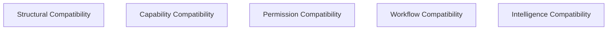

# KWANUS OS — Partner Compatibility Framework (PartnerCompatibilityFramework)
The complete compatibility system, compatibility strands, compatibility checks, compatibility lineage, compatibility migrations, and ceremonial compatibility rites of the KWANUS Operating System partner universe.

This framework defines:
- compatibility philosophy  
- compatibility categories  
- compatibility tiers  
- compatibility strands  
- compatibility checks  
- compatibility lineage  
- compatibility evolution  
- compatibility migrations  
- compatibility governance  
- compatibility validation  
- compatibility sustainability  
- compatibility protection  
- compatibility health  
- ceremonial compatibility rites  

It is the **compatibility backbone** of the partner universe.

---

# 1. Compatibility Philosophy

Compatibility in the partner universe must be:
- harmonic  
- preventative  
- ceremonial  
- emotionally intelligent  
- lifecycle-aware  
- trust-aware  
- capability-aware  
- permission-aware  
- workflow-aware  
- reversible  
- lineage-tracked  

Compatibility is not matching — it is **cosmic resonance**.

---

# 2. Compatibility Categories

The partner universe contains **five compatibility categories**:

Each category ensures a different dimension of alignment.

---

# 3. Compatibility Tiers

Compatibility is organized into **three compatibility tiers**, aligned with the partner tier system:

| Tier | Name | Focus |
| :--- | :--- | :--- |
| **Tier 1** | The Eye (Baseline) | Basic alignment, version matching, structural coherence. |
| **Tier 2** | The Loom (Operational) | Workflow, capability, and permission alignment. |
| **Tier 3** | The Flame (Intelligence) | Intelligence harmonics, predictive alignment, autonomous coordination. |

---

# 4. Compatibility Strands

Compatibility is expressed through **five strands**:

1. **Strand 1 — Version Strand**: OS and partner version parity.
2. **Strand 2 — Structure Strand**: Schema and metadata alignment.
3. **Strand 3 — Capability Strand**: Functional power alignment.
4. **Strand 4 — Permission Strand**: Responsibility and access alignment.
5. **Strand 5 — Workflow Strand**: Operational flow alignment.

Each strand must remain aligned for compatibility to hold.

---

# 5. Compatibility Checks

Compatibility checks occur when partners:
- activate, expand, or evolve  
- migrate or integrate  
- remediate or destabilize  

Checks examine version, structural, capability, permission, workflow, and intelligence alignment.

---

# 6. Compatibility Lineage & Evolution

- **Lineage**: Tracks the story of version changes, migrations, and validations across a partner's entire lifecycle.
- **Evolution**: Compatibility evolves through **Expansion**, **Enhancement**, **Transformation**, **Migration**, and **Illumination**.

---

# 7. Compatibility Migrations

Migrations handle transitions between versions or structures.

- **Soft Migration**: Invisible, background updates.
- **Guided Migration**: OS-assisted transition with partner awareness.
- **Forced Migration**: Required for stability; governance-driven.
- **Fallback Migration**: Reversion to a known-stable state.

---

# 8. Compatibility Governance & Validation

- **TSC** → Structural integrity authority.
- **ERC** → Workflow and functional authority.
- **Validation**: Required before any state transition. Ensures schema, signature, and lineage integrity.

---

# 9. Compatibility Health

Compatibility health is measured across all alignment dimensions.

| Health Score | Status | Action |
| :--- | :--- | :--- |
| **90–100** | Harmonized | Optimal Resonance |
| **75–89** | Stable | Standard Monitoring |
| **60–74** | Vulnerable | Migration Review |
| **40–59** | At Risk | Throttling / Fallback |
| **0–39** | Fragmented | Restriction / Review |

---

# 10. Ceremonial Compatibility Rites

Compatibility evolution is ritualized:

- **Rite of Alignment**: “The threads meet. Harmony begins.”
- **Rite of Migration**: “The pattern shifts. The weave adapts.”
- **Rite of Fusion**: “The strands merge. A new harmony forms.”
- **Rite of Illumination**: “The inner light brightens. Resonance deepens.”
- **Rite of Release**: “The weave loosens. Compatibility dissolves.”

---

# 11. Summary

The Partner Compatibility Framework provides the structural resonance of the partner universe. It ensures that every partner remains aligned, stable, and resonant with the living ecosystem of the KWANUS OS.
