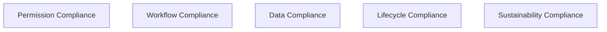
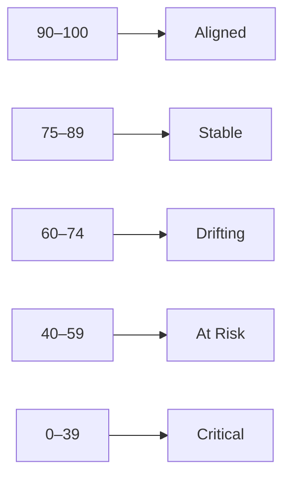
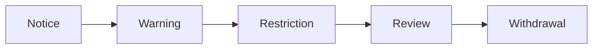
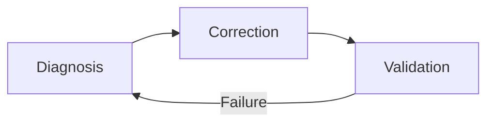

# KWANUS OS — Partner Compliance Framework (PartnerComplianceFramework)
The complete compliance, audit, threshold, and enforcement framework governing partner safety, alignment, and trustworthiness within the KWANUS Operating System.

This framework defines:
- compliance categories  
- compliance rules  
- compliance thresholds  
- compliance audits  
- compliance scoring  
- compliance drift detection  
- enforcement logic  
- escalation logic  
- remediation logic  
- lifecycle integration  
- compatibility integration  
- sustainability integration  

It is the **compliance backbone** of the partner universe.

---

# 1. Compliance Philosophy

Compliance in the partner universe must be:
- preventative  
- predictable  
- ceremonial  
- emotionally intelligent  
- lifecycle‑aligned  
- compatibility‑aware  
- sustainability‑aware  
- non‑punitive  
- governance‑driven  

Compliance is not punishment — it is **alignment**.

---

# 2. Compliance Categories

The partner universe contains **five compliance categories**:

Each category has rules, thresholds, and audits.

---

# 3. Compliance Rules

## 1. Permission Compliance Rules
- least privilege required  
- no unused permissions  
- no permission drift  
- no unauthorized elevation  

## 2. Workflow Compliance Rules
- workflows must be stable  
- workflows must be compatible  
- workflows must follow governance  

## 3. Data Compliance Rules
- no unauthorized retention  
- no unauthorized export  
- deletion must follow lifecycle  

## 4. Lifecycle Compliance Rules
- partners must follow lifecycle  
- partners must acknowledge transitions  
- partners must complete rites  

## 5. Sustainability Compliance Rules
- health metrics must remain above thresholds  
- drift must be corrected  
- collapse triggers withdrawal  

---

# 4. Compliance Thresholds

Each category has thresholds:

## Permission Thresholds
- 0 unauthorized permissions  
- 0 unused permissions  
- 0 permission drift  

## Workflow Thresholds
- 99% uptime  
- <1% error rate  
- 0 incompatible workflows  

## Data Thresholds
- 0 unauthorized retention  
- 0 unauthorized export  
- 100% deletion compliance  

## Lifecycle Thresholds
- 100% rite completion  
- 100% transition acknowledgment  

## Sustainability Thresholds
- workflow health ≥ 80  
- permission health ≥ 80  
- compliance health ≥ 90  
- integration health ≥ 85  
- ecosystem health ≥ 80  

---

# 5. Compliance Audits

Audits occur on three cycles:

## 1. Continuous Audits  
- permission drift  
- workflow errors  
- data retention  

## 2. Quarterly Audits  
- workflow health  
- permission health  
- integration health  

## 3. Annual Audits  
- full compliance review  
- lifecycle alignment  
- sustainability review  

Audits are ceremonial, not punitive.

---

# 6. Compliance Scoring

Partners receive a **Compliance Score** (0–100):

Scores determine:
- governance attention  
- sustainability interventions  
- lifecycle transitions  

---

# 7. Compliance Drift Detection

Drift is detected when:
- permissions change unexpectedly  
- workflows degrade  
- data retention increases  
- lifecycle steps are skipped  
- sustainability metrics fall  

Drift triggers:
- alerts  
- remediation  
- governance review  

---

# 8. Enforcement Logic

Enforcement follows a **five‑step escalation path**:

## Step 1 — Notice  
Partner is informed of drift.

## Step 2 — Warning  
Partner must remediate.

## Step 3 — Restriction  
Capabilities are limited.

## Step 4 — Review  
Governance evaluates partner.

## Step 5 — Withdrawal  
Partner enters deprecation → EoS.

Enforcement is always:
- ceremonial  
- predictable  
- governed  

---

# 9. Remediation Logic

Remediation follows a **three‑step loop**:

## Diagnosis  
OS identifies root cause.

## Correction  
Partner implements fix.

## Validation  
OS confirms alignment.

If validation fails → escalation.

---

# 10. Lifecycle Integration

Compliance maps to lifecycle:

- **Active** → Compliance monitored  
- **Maintenance** → Compliance corrected  
- **Deprecation** → Compliance frozen  
- **EoS** → Compliance irrelevant  
- **Post‑EoS** → Compliance archived  

---

# 11. Compatibility Integration

Compliance ensures:
- version alignment  
- migration completion  
- fallback usage  
- validation success  

Non‑compliance triggers:
- fallback  
- migration  
- restriction  

---

# 12. Sustainability Integration

Compliance ensures:
- health metrics remain stable  
- drift is corrected  
- collapse is prevented  

Sustainability collapse triggers:
- restriction  
- withdrawal  

---

# 13. Ceremonial Compliance

Compliance events are ritualized:

## Notice  
> “The strands drift. Realign.”

## Warning  
> “The loom frays. Restore the weave.”

## Restriction  
> “The gate narrows. Proceed with care.”

## Review  
> “The councils gather. Await judgment.”

## Withdrawal  
> “The light dims. Prepare for release.”

Ceremony maintains dignity.

---

# 14. Summary

The Partner Compliance Framework provides:
- the rules  
- the thresholds  
- the audits  
- the scoring  
- the drift detection  
- the enforcement logic  
- the remediation logic  
- the lifecycle integration  
- the compatibility integration  
- the sustainability integration  

…that ensure partners remain **safe, aligned, and trustworthy**.

It is the **compliance backbone** of the partner universe.
