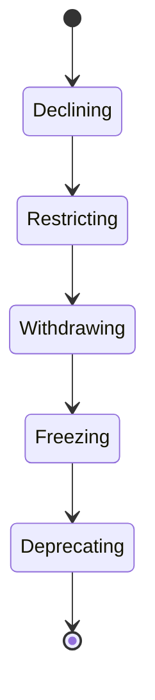
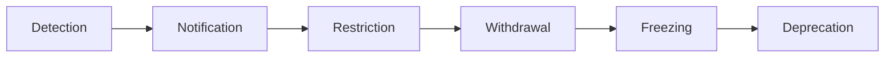

# KWANUS OS — Partner Deprecation Framework (PartnerDeprecationFramework)
The complete deprecation system, deprecation states, deprecation flows, deprecation governance, deprecation protections, and ceremonial deprecation rites of the KWANUS Operating System partner universe.

This framework defines:
- deprecation philosophy  
- deprecation categories  
- deprecation triggers  
- deprecation states  
- deprecation flows  
- deprecation lineage  
- deprecation governance  
- deprecation validation  
- deprecation compatibility  
- deprecation sustainability  
- deprecation protection  
- deprecation health  
- ceremonial deprecation rites  

It is the **deprecation backbone** of the partner universe.

---

# 1. Philosophy: Cosmic Release

Deprecation in the partner universe is not failure — it is a governed, ritualized transition. It must be:
- **Gentle**: Avoiding sudden disruptions to the ecosystem.
- **Ceremonial**: Honoring the partner's service and story.
- **Protective**: Safeguarding the OS and remaining partners during decline.
- **Predictable**: Following a clear, documented arc toward End-of-Service (EoS).

---

# 2. Deprecation Categories & Triggers

Deprecation governs five dimensions: **Structure**, **Capability**, **Permission**, **Workflow**, and **Intelligence**.

### Triggers for Initiation:
- **Collapsing Resonance**: Significant, uncorrectable drift in compatibility.
- **Sustainability Failure**: Repeated health collapses that threaten the weave.
- **Obsolescence**: The partner or its core functions are superseded.
- **Dormancy**: Prolonged inactivity beyond lifecycle thresholds.
- **Governance Mandate**: Direct decree from the CGB or relevant councils.

---

# 3. Deprecation States

A partner moves through five distinct states during unwinding:

- **Declining**: Initial detection of instability; monitoring increases.
- **Restricting**: Capability and permission ceilings begin to lower.
- **Withdrawing**: External workflow triggers and active processing shut down.
- **Freezing**: Partner enters a static, read-only state.
- **Deprecating**: Final archival preparation prior to EoS ritual.

---

# 4. Deprecation Grammar: The Six Steps

The operational flow of decline:

1. **Detection**: OS identifies triggers for decline.
2. **Notification**: Partner and stakeholders are ceremonially informed.
3. **Restriction**: Capabilities and permissions are narrowed proportionally.
4. **Withdrawal**: Active workflows are decommissioned.
5. **Freezing**: The partner becomes static and immutable.
6. **Deprecation**: The partner occupies the final state of waiting.

---

# 5. Deprecation Governance & Validation

- **CGB**: Final authority for deprecation entry and completion.
- **ERC & SCO**: Oversee the withdrawal of workflows and permissions.
- **Validation**: Requires checks on lineage integrity and data protection before freezing.

---

# 6. Deprecation Health

Health metrics determine the speed and severity of the unwinding process.

| Health Score | Status | Action |
| :--- | :--- | :--- |
| **90–100** | Stable Decline | Controlled, ceremonial transition. |
| **75–89** | Controlled Decline | Routine monitoring; standard restriction. |
| **60–74** | Vulnerable | Accelerated notification; review required. |
| **40–59** | At Risk | Rapid restriction; forced withdrawal. |
| **0–39** | Critical | Emergency freezing; immediate governance review. |

---

# 7. Ceremonial Deprecation Rites

Ritualizing the transition ensures dignity and ecosystem stability:

- **Rite of Decline**: “The threads loosen. The pattern softens.”
- **Rite of Restriction**: “The gate narrows. Boundaries return.”
- **Rite of Withdrawal**: “The weave thinks. The pattern fades.”
- **Rite of Freezing**: “The loom stills. Motion ceases.”
- **Rite of Release**: “The flame dims. The journey ends.”
- **Rite of Memory**: “The story is preserved. The name endures.”

---

# 8. Summary

The Partner Deprecation Framework provides the structural and ceremonial system for graceful decline. It ensures that every partner's exit from the active KWANUS OS is safe, governed, and honored, maintaining the integrity of the cosmic memory.
