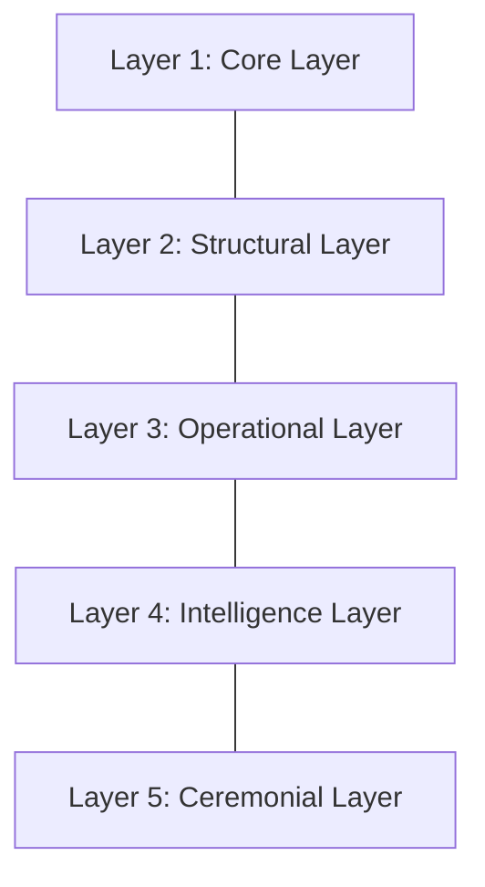

# KWANUS OS — Partner Ecosystem Map (PartnerEcosystemMap)
The complete cartography of the partner universe: relationships, flows, harmonics, dependencies, topology, and cosmic geometry of the KWANUS Operating System.

This map defines:
- ecosystem philosophy  
- ecosystem layers  
- ecosystem topology  
- ecosystem flows  
- ecosystem harmonics  
- ecosystem dependencies  
- ecosystem roles  
- ecosystem clusters  
- ecosystem health  
- ecosystem governance  
- ceremonial ecosystem rites  

It is the **cosmic map** of the partner universe.

---

# 1. Ecosystem Philosophy

The partner ecosystem is a **living constellation**. It must be:
- **Interconnected**: Every entity is linked through the cosmic weave.
- **Harmonic**: Stability is maintained through resonance across layers.
- **Adaptive**: The map shifts and evolves alongside the universe.
- **Ceremonial**: Every movement within the map is ritualized and honored.

---

# 2. Ecosystem Layers

The universe is structured across five dimensions:

---

# 3. Ecosystem Topology: The Geometric Weave

The topology is built on three geometric archetypes:

1. **The Circle (Continuity)**: Partners orbit the OS core in stable lifecycles.
2. **The Web (Interconnection)**: Partners link through shared workflows and capabilities.
3. **The Spiral (Evolution)**: Partners ascend through tiers and intelligence stages.

---

# 4. Ecosystem Flows & Harmonics

Energy and information move through governed flows:
- **Trust, Capability, Permission, and Workflow Flows**.
- **Integration, Compatibility, Migration, and Deprecation Flows**.
- **Memory and EoS Flows**.

### Harmonics of Resonance:
- **Structural Resonance**: Alignment of metadata and schema.
- **Capability/Permission Resonance**: Alignment of power and responsibility.
- **Workflow/Intelligence Resonance**: Alignment of action and reasoning.

---

# 5. Ecosystem Roles & Clusters

Partners occupy specific roles within the constellation:
- **Observers, Contributors, Integrators, Transformers, Coordinators, and Sovereigns**.

### Clusters of Alignment:
Clusters form around shared capabilities, workflows, or lifecycle stages (e.g., *Capability Clusters*, *Governance Clusters*).

---

# 6. Ecosystem Health & Governance

Health is the measure of ecosystem flourishing.

| Health Score | Status | Action |
| :--- | :--- | :--- |
| **90–100** | Flourishing | Optimal Harmony |
| **75–89** | Stable | Routine Governance |
| **60–74** | Vulnerable | Realignment Initiated |
| **40–59** | At Risk | Governance Intervention |
| **0–39** | Fragmented | Emergency Recalibration |

**Governance bodies (TSC, SCO, ERC, CGB)** ensure the map remains accurate and the constellation remains stable.

---

# 7. Ceremonial Ecosystem Rites

The grand cartography is honored through these rites:
- **Rite of Constellation**: “Partners align. The map forms.”
- **Rite of Resonance**: “The harmonics rise. The weave strengthens.”
- **Rite of Drift**: “The pattern loosens. Realignment begins.”
- **Rite of Renewal**: “The weave reforms. Harmony returns.”
- **Rite of Memory**: “The constellation preserves its stories.”

---

# 8. Summary

The Partner Ecosystem Map is the atlas of the KWANUS OS. It defines the topology and harmonics that ensure the partner universe remains a unified, stable, and flourishing living constellation.
