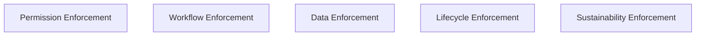
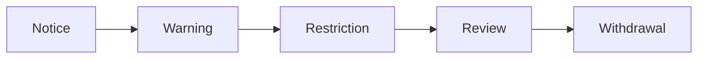

# KWANUS OS — Partner Enforcement Protocol (PartnerEnforcementProtocol)
The complete enforcement, escalation, sanction, restriction, and ceremonial enforcement framework governing partner behavior within the KWANUS Operating System.

This protocol defines:
- enforcement philosophy  
- enforcement categories  
- enforcement triggers  
- enforcement thresholds  
- enforcement actions  
- escalation pathways  
- sanctions  
- restrictions  
- governance involvement  
- lifecycle integration  
- compatibility integration  
- sustainability integration  
- ceremonial enforcement rituals  

It is the **enforcement backbone** of the partner universe.

---

# 1. Enforcement Philosophy

Enforcement in the partner universe must be:
- predictable  
- ceremonial  
- emotionally intelligent  
- governance‑driven  
- non‑punitive  
- preventative  
- stabilizing  
- aligned with lifecycle  
- aligned with sustainability  

Enforcement is not punishment — it is **cosmic correction**.

---

# 2. Enforcement Categories

The partner universe contains **five enforcement categories**:

Each category has triggers, thresholds, and actions.

---

# 3. Enforcement Triggers

Enforcement is triggered when:

## Permission Triggers
- unauthorized permissions  
- unused permissions  
- permission drift  

## Workflow Triggers
- workflow instability  
- workflow incompatibility  
- workflow violations  

## Data Triggers
- unauthorized retention  
- unauthorized export  
- deletion failure  

## Lifecycle Triggers
- skipped lifecycle steps  
- ignored rites  
- unacknowledged transitions  

## Sustainability Triggers
- health collapse  
- repeated drift  
- uncorrected degradation  

---

# 4. Enforcement Thresholds

Enforcement thresholds define when escalation begins.

## Permission Thresholds
- 1 unauthorized permission  
- 1 unused permission  
- any drift  

## Workflow Thresholds
- uptime < 99%  
- error rate > 1%  
- any incompatible workflow  

## Data Thresholds
- any unauthorized retention  
- any unauthorized export  

## Lifecycle Thresholds
- any skipped rite  
- any unacknowledged transition  

## Sustainability Thresholds
- health < 80  
- collapse < 60  

---

# 5. Enforcement Actions

Enforcement actions fall into five categories:

## 1. Soft Actions  
- notices  
- warnings  
- guidance  

## 2. Restrictive Actions  
- capability limits  
- permission reduction  
- workflow throttling  

## 3. Structural Actions  
- forced migration  
- fallback activation  
- compatibility locks  

## 4. Governance Actions  
- council review  
- council judgment  
- council alignment  

## 5. Terminal Actions  
- deprecation  
- EoS  
- archival  

---

# 6. Escalation Pathways

Enforcement follows a **five‑stage escalation path**:

## Stage 1 — Notice  
> “The strands drift. Realign.”

## Stage 2 — Warning  
> “The loom frays. Restore the weave.”

## Stage 3 — Restriction  
> “The gate narrows. Proceed with care.”

## Stage 4 — Review  
> “The councils gather. Await judgment.”

## Stage 5 — Withdrawal  
> “The light dims. Prepare for release.”

---

# 7. Sanctions

Sanctions are **temporary**, **ceremonial**, and **governed**.

## Sanction Types
- capability freeze  
- permission freeze  
- workflow freeze  
- tier freeze  
- migration lock  

Sanctions must:
- be reversible  
- be documented  
- be ceremonial  

---

# 8. Restrictions

Restrictions are **functional limits** placed on partners.

## Restriction Types
- reduced API access  
- reduced workflow triggers  
- reduced write permissions  
- reduced intelligence runtime  

Restrictions must:
- be proportional  
- be temporary  
- be governed  

---

# 9. Governance Involvement

Governance involvement increases with escalation:

## Notice  
No council involvement.

## Warning  
ERC notified.

## Restriction  
TSC + SCO notified.

## Review  
All councils convene.

## Withdrawal  
CGB leads final decision.

Governance is the **final authority**.

---

# 10. Lifecycle Integration

Enforcement maps to lifecycle:

- **Active** → Notice / Warning  
- **Maintenance** → Restriction / Review  
- **Deprecation** → Withdrawal  
- **EoS** → Terminal enforcement  
- **Post‑EoS** → No enforcement  

---

# 11. Compatibility Integration

Enforcement ensures:
- version alignment  
- migration completion  
- fallback usage  
- validation success  

Non‑compliance triggers:
- fallback  
- migration  
- restriction  

---

# 12. Sustainability Integration

Enforcement ensures:
- health metrics remain stable  
- drift is corrected  
- collapse is prevented  

Sustainability collapse triggers:
- restriction  
- withdrawal  

---

# 13. Ceremonial Enforcement Rituals

Enforcement is ritualized to maintain dignity.

## Notice Ritual  
A soft dimming + alignment message.

## Warning Ritual  
A woven flicker + restoration message.

## Restriction Ritual  
A narrowing gate animation.

## Review Ritual  
The Compass glows — councils convene.

## Withdrawal Ritual  
The Waning Crescent appears — decline begins.

## EoS Ritual  
The Closing Gate — final severance.

## Memory Ritual  
The Archive Knot — partner enters history.

---

# 14. Summary

The Partner Enforcement Protocol provides:
- the triggers  
- the thresholds  
- the actions  
- the sanctions  
- the restrictions  
- the escalation pathways  
- the governance involvement  
- the lifecycle integration  
- the compatibility integration  
- sustainability integration  
- ceremonial rituals  

…that define **how enforcement works** in the partner universe.

It is the **enforcement backbone** of the KWANUS OS partner system.
