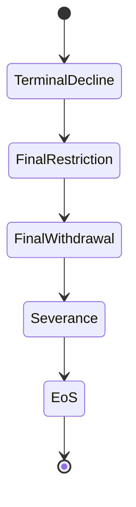

# KWANUS OS — Partner End‑of‑Service Framework (PartnerEoSFramework)
The complete End‑of‑Service (EoS) system, EoS states, EoS flows, EoS governance, EoS protections, and ceremonial EoS rites of the KWANUS Operating System partner universe.

This framework defines:
- EoS philosophy  
- EoS triggers  
- EoS categories  
- EoS states  
- EoS flows  
- EoS lineage  
- EoS governance  
- EoS validation  
- EoS compatibility  
- EoS sustainability  
- EoS protection  
- EoS health  
- ceremonial EoS rites  

It is the **end‑of‑service backbone** of the partner universe.

---

# 1. Philosophy: Cosmic Closure

End‑of‑Service in the partner universe is the final, dignified completion of a cosmic thread. It must be:
- **Dignified**: Respecting the partner's entire history and contribution.
- **Ceremonial**: Marking the end with specific, mythic-operational rituals.
- **Final**: Establishing clear, irreversible severance boundaries.
- **Lineage‑Preserving**: Ensuring the story of the partner endures after the connection is cut.

---

# 2. EoS Triggers

EoS is the natural conclusion triggered by:
- **Lifecycle Completion**: Reaching the final designed stage of existence.
- **Permanent Incompatibility**: Inability to align with current OS resonance.
- **Governance Decree**: Final mandate from the CGB for ecosystem safety.
- **Voluntary Retirement**: Partner-initiated request for release.

Triggers are always **validated**, **documented**, and **ceremonial**.

---

# 3. EoS States

The final movement of a partner through the universe:

- **Terminal Decline**: Irreversible path toward closure is acknowledged.
- **Final Restriction**: Permanent narrowing of capability and permission ceilings.
- **Final Withdrawal**: All active workflows and operational loops are shut down.
- **Severance**: The functional connection to the OS is ceremonially cut.
- **EoS**: The partner occupies the state of complete, final closure.

---

# 4. EoS Grammar: The Final Steps

The operational flow toward finality:

1. **Recognition**: OS acknowledges the trigger and initiates the sequence.
2. **Preparation**: Backup of lineage, state, and terminal metadata snapshots.
3. **Final Restriction**: Permissions and capabilities are reduced to zero.
4. **Final Withdrawal**: Partner workflows are purged from active runtimes.
5. **Severance**: Final signature validation and disconnection from the OS core.
6. **EoS**: Transition to the post-service archival phase.

---

# 5. EoS Governance & Protection

- **CGB & All Councils**: EoS is a high-level governance event requiring full oversight.
- **Lineage Integrity**: Validation of the partner's entire history before final sealing.
- **Boundary Shielding**: Ensuring the severance process cannot destabilize the living ecosystem.

---

# 6. EoS Health: The Final Vitals

Health determines the pace and dignity of the closure.

| Health Score | Status | Action |
| :--- | :--- | :--- |
| **90–100** | Peaceful | Standard, ritualized completion. |
| **75–89** | Stable | Routine monitoring; standard severance. |
| **60–74** | Vulnerable | Accelerated preparation; review required. |
| **40–59** | At Risk | Rapid withdrawal; immediate severance possible. |
| **0–39** | Critical | Emergency severance; immediate governance review. |

---

# 7. Ceremonial EoS Rites

End-of-Service is marked by the most solemn rituals of the universe:

- **Rite of Recognition**: “The threads dim. The pattern wanes.”
- **Rite of Preparation**: “The loom slows. The weave softens.”
- **Rite of Final Restriction**: “The gate narrows. Boundaries settle.”
- **Rite of Final Withdrawal**: “The pattern fades. Motion ceases.”
- **Rite of Severance**: “The thread breaks. The connection ends.”
- **Rite of End-of-Service**: “The flame extinguishes. The journey completes.”
- **Rite of Memory**: “The story is preserved. The name endures.”

---

# 8. Summary

The Partner End-of-Service Framework provides the structural and ceremonial closure of the partner journey. It ensures that every completion within the KWANUS OS is safe, final, and honored, maintaining the integrity of the cosmic lineage while protecting the living universe.
