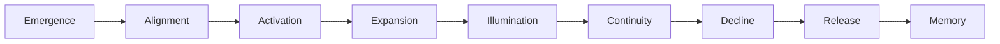

# KWANUS OS — Partner Experience Specification (PartnerExperienceSpec)
The complete experiential, emotional, and interactional identity of the KWANUS Operating System partner universe.

This specification defines:
- emotional tone  
- interaction patterns  
- onboarding experience  
- partner journey UX  
- ceremonial transitions  
- sensory cues  
- feedback language  
- partner states  
- governance interactions  
- lifecycle experiences  
- compatibility experiences  
- sustainability experiences  

It is the **experiential backbone** of the partner universe.

---

# 1. Experience Philosophy

The partner experience must be:
- emotionally intelligent  
- ceremonial  
- predictable  
- grounded  
- mythic‑modern  
- respectful  
- governed  
- stable  

Partners should feel:
- oriented  
- supported  
- guided  
- accountable  
- aligned  
- part of a living universe  

---

# 2. Emotional Tone

The emotional tone of the partner universe is:
- calm  
- clear  
- ceremonial  
- steady  
- grounded  
- mythic  
- structured  

Tone never becomes:
- frantic  
- punitive  
- chaotic  
- ambiguous  

Even during decline or dissolution, tone remains **dignified**.

---

# 3. Interaction Patterns

Partner interactions follow five core patterns:

## Pattern 1 — Orientation  
Partners are always shown where they are in the universe.

## Pattern 2 — Guidance  
Partners are given clear next steps, never left guessing.

## Pattern 3 — Reflection  
Partners receive feedback that is calm, factual, and ceremonial.

## Pattern 4 — Alignment  
Partners are reminded of governance, compatibility, and lifecycle.

## Pattern 5 — Continuity  
Partners always feel part of a larger, ongoing story.

---

# 4. Onboarding Experience

The onboarding experience is a **ceremonial initiation**.

It includes:
- a Rite of Entry  
- alignment with governance  
- capability declaration  
- compatibility mapping  
- lifecycle orientation  
- symbolic activation  

The tone is:
- welcoming  
- structured  
- mythic  
- clear  

---

# 5. Partner Journey UX

The partner journey is designed as a **guided path**:

Each stage has:
- a visual state  
- a symbolic state  
- a narrative state  
- a governance state  
- a compatibility state  
- a sustainability state  

Partners always know:
- where they are  
- what is expected  
- what comes next  

---

# 6. Ceremonial Transitions

Every major transition is ritualized:

## Activation  
A soft pulse of light + a brief ceremonial message.

## Expansion  
An unfolding animation + a governance blessing.

## Evolution  
A rising illumination + a symbolic tier shift.

## Deprecation  
A gentle dimming + a dignified message of withdrawal.

## EoS  
A stilling of motion + a closing gate symbol.

## Post‑EoS  
A hollow shell icon + archival confirmation.

Transitions are never abrupt.

---

# 7. Sensory Cues

The partner universe uses subtle sensory cues:

## Visual  
- glows  
- fades  
- pulses  
- woven motions  
- rising light  

## Motion  
- slow  
- intentional  
- ceremonial  

## Sound (optional)  
- soft chimes  
- low hums  
- gentle fades  

No harsh sounds.  
No sudden movements.

---

# 8. Feedback Language

Feedback must be:
- calm  
- factual  
- ceremonial  
- emotionally intelligent  

Examples:

**Alignment Needed**  
“Your path drifts from the Compass. Let us realign.”

**Compatibility Required**  
“The strands must be woven anew. Begin migration.”

**Sustainability Decline**  
“The spiral tightens. Renewal is needed.”

**Deprecation Notice**  
“The light begins to dim. Prepare for release.”

**EoS**  
“The gate closes. Your journey enters memory.”

---

# 9. Partner States

Partners experience five emotional‑functional states:

## State 1 — Oriented  
They know where they are.

## State 2 — Supported  
They know what to do.

## State 3 — Empowered  
They can act with clarity.

## State 4 — Accountable  
They understand governance.

## State 5 — Integrated  
They feel part of the universe.

---

# 10. Governance Interactions

Governance interactions must feel:
- firm  
- fair  
- ceremonial  
- predictable  

Governance never:
- shames  
- surprises  
- punishes  

Governance always:
- guides  
- aligns  
- clarifies  
- protects  

---

# 11. Lifecycle Experiences

Each lifecycle stage has a distinct experiential tone:

## Active  
Bright, stable, confident.

## Maintenance  
Muted, reflective, supportive.

## Deprecation  
Soft, dignified, gentle.

## EoS  
Still, quiet, respectful.

## Post‑EoS  
Archival, distant, peaceful.

---

# 12. Compatibility Experiences

Compatibility transitions feel:
- guided  
- structured  
- ceremonial  

Partners receive:
- migration maps  
- fallback confirmations  
- validation rituals  

---

# 13. Sustainability Experiences

Sustainability is experienced as:
- renewal  
- reflection  
- recalibration  

Partners feel:
- supported  
- guided  
- aligned  

---

# 14. Summary

The Partner Experience Specification provides:
- the emotional tone  
- the interaction patterns  
- the ceremonial UX  
- the sensory cues  
- the lifecycle experiences  
- the governance interactions  

…that define how partners *feel* inside the KWANUS OS.

It is the **experiential backbone** of the partner universe.
