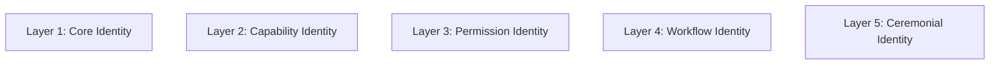
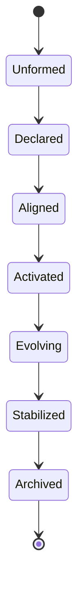

# KWANUS OS — Partner Identity Framework (PartnerIdentityFramework)
The complete identity, signature, lineage, metadata, and ceremonial identity-state system of the KWANUS Operating System partner universe.

This framework defines:
- identity philosophy  
- identity layers  
- identity states  
- identity signatures  
- identity lineage  
- identity metadata  
- identity verification  
- identity evolution  
- identity rites  
- identity governance  
- identity protection  
- identity archival  

It is the **identity backbone** of the partner universe.

---

# 1. Identity Philosophy

Identity in the partner universe must be:
- sovereign  
- stable  
- ceremonial  
- emotionally intelligent  
- lifecycle-aware  
- trust-aware  
- compatibility-aware  
- governed  
- protected  

Identity is not a label — it is a **cosmic position**.

---

# 2. Identity Layers

Partner identity is composed of **five layers**:

Each layer reveals a different dimension of the partner’s existence.

---

# 3. Core Identity

Core Identity includes:
- partner ID  
- partner name  
- partner type  
- partner tier  
- partner trust level  
- partner lifecycle stage  

Core Identity is immutable except through ceremony.

---

# 4. Capability Identity

Capability Identity includes:
- capabilities granted  
- capabilities used  
- capability lineage  
- capability signatures  

Capability Identity evolves through:
- expansion  
- evolution  
- governance approval  

---

# 5. Permission Identity

Permission Identity includes:
- permissions granted  
- permissions used  
- permission ceilings  
- permission lineage  

Permission Identity is governed by:
- SCO (The Sentinel)
- Trust score  
- Lifecycle stage  

---

# 6. Workflow Identity

Workflow Identity includes:
- workflows owned  
- workflows triggered  
- workflow lineage  
- workflow compatibility  

Workflow Identity evolves through:
- integration  
- validation  
- sustainability  

---

# 7. Ceremonial Identity

Ceremonial Identity includes:
- rites completed  
- rites pending  
- rites failed  
- ceremonial lineage  
- ceremonial symbols  

Ceremony defines identity transitions.

---

# 8. Identity States

Partners exist in one of **seven identity states**:

## Unformed  
Partner has no identity yet.

## Declared  
Partner has submitted identity.

## Aligned  
Identity verified by governance.

## Activated  
Identity enters the universe.

## Evolving  
Identity shifts through tiers.

## Stabilized  
Identity becomes long-term.

## Archived  
Identity preserved in memory.

---

# 9. Identity Signatures

Identity signatures ensure authenticity.

Signatures include:
- cryptographic signature  
- capability signature  
- permission signature  
- workflow signature  
- ceremonial signature  

Signatures must:
- be unique  
- be verifiable  
- be immutable  

---

# 10. Identity Lineage

Identity lineage tracks:
- origin  
- expansions  
- evolutions  
- migrations  
- deprecations  
- EoS  
- archival  

Lineage is the **story** of the partner.

---

# 11. Identity Metadata

Metadata includes:
- creation timestamp  
- activation timestamp  
- tier history  
- trust history  
- compliance history  
- sustainability history  
- governance decisions  

Metadata is:
- immutable  
- auditable  
- ceremonial  

---

# 12. Identity Verification

Identity verification occurs at:
- onboarding  
- expansion  
- evolution  
- migration  
- validation  
- remediation  
- deprecation  

Verification includes:
- signature checks  
- lineage checks  
- trust checks  
- compatibility checks  
- governance checks  

---

# 13. Identity Evolution

Identity evolves through:
- capability expansion  
- tier elevation  
- trust increase  
- lifecycle transitions  
- ceremonial rites  

Evolution is always:
- governed  
- ceremonial  
- documented  

---

# 14. Identity Rites

Identity rites include:

## Rite of Declaration  
Partner declares identity.

## Rite of Alignment  
Governance verifies identity.

## Rite of Activation  
Identity enters the universe.

## Rite of Expansion  
Identity grows in capability.

## Rite of Evolution  
Identity ascends in tier.

## Rite of Release  
Identity prepares for EoS.

## Rite of Memory  
Identity enters the archive.

---

# 15. Identity Governance

Identity governance is handled by:
- **SCO** (permissions)  
- **TSC** (structure)  
- **ERC** (workflows)  
- **CGB** (ecosystem)  

Governance ensures:
- authenticity  
- stability  
- alignment  

---

# 16. Identity Protection

Identity is protected through:
- boundary shielding  
- signature validation  
- lineage verification  
- permission ceilings  
- capability ceilings  
- workflow ceilings  

Identity cannot be:
- forged  
- overwritten  
- duplicated  

---

# 17. Identity Archival

Archived identity includes:
- final signature  
- final lineage  
- final metadata  
- ceremonial closure  

Archived identity is:
- immutable  
- preserved  
- honored  

---

# 18. Summary

The Partner Identity Framework provides the foundation for how partners are known, recognized, and remembered in the KWANUS OS. It ensures that every partner's existence is documented through its lineage and confirmed through its core signatures.
