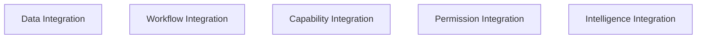

# KWANUS OS — Partner Integration Framework (PartnerIntegrationFramework)
The complete integration system, integration flows, integration lineage, integration health, integration compatibility, integration governance, and ceremonial integration rites of the KWANUS Operating System partner universe.

This framework defines:
- integration philosophy  
- integration categories  
- integration tiers  
- integration flows  
- integration lineage  
- integration evolution  
- integration governance  
- integration validation  
- integration compatibility  
- integration sustainability  
- integration protection  
- integration health  
- ceremonial integration rites  

It is the **integration backbone** of the partner universe.

---

# 1. Integration Philosophy

Integration in the partner universe must be:
- harmonious  
- governed  
- ceremonial  
- emotionally intelligent  
- lifecycle-aware  
- trust-aware  
- compatibility-aware  
- sustainability-aware  
- reversible  
- lineage-tracked  

Integration is not connection — it is **cosmic weaving**.

---

# 2. Integration Categories

The partner universe contains **five integration categories**:

Each category corresponds to a dimension of partner interconnection.

---

# 3. Integration Tiers

Integration is organized into **three integration tiers**, aligned with the partner tier system:

| Tier | Name | Focus |
| :--- | :--- | :--- |
| **Tier 1** | The Eye (Observation Integration) | Reading, observing, basic data flow. |
| **Tier 2** | The Loom (Operational Integration) | Workflow merging, capability linking, multi-step operational flow. |
| **Tier 3** | The Flame (Intelligence Integration) | Intelligence-level coordination, autonomous decision support, predictive harmonics. |

---

# 4. Integration Flows

Integration flows follow a **five-step integration grammar**:

1. **Discovery**: Partners identify integration points.
2. **Mapping**: Partners align structures, permissions, and capabilities.
3. **Binding**: Integration becomes active.
4. **Validation**: Integration is tested for compatibility and sustainability.
5. **Continuity**: Integration becomes part of the living ecosystem.

---

# 5. Integration Lineage & Evolution

- **Lineage**: Tracks the origin, mappings, bindings, and evolution of every integration point. It is the narrative of interconnection.
- **Evolution**: Integrations evolve through **Expansion**, **Enhancement**, **Transformation**, **Fusion**, and **Illumination** (gaining intelligence).

---

# 6. Integration Governance & Validation

- **ERC** → Primary authority for integration integrity.
- **TSC** → Structural alignment authority.
- **Validation**: Occurs during additions, modifications, or elevations. Checks compatibility, sustainability, and trust levels.

---

# 7. Integration Compatibility & Sustainability

- **Compatibility**: Integrations must align with the partner tier, OS version, and workflow constraints. Incompatibility triggers fallback or restriction.
- **Sustainability**: Integrations must maintain ecosystem health. Metrics collapse triggers throttling or withdrawal.

---

# 8. Integration Health

Integration health is measured across stability, compatibility, sustainability, and ecosystem impact.

| Health Score | Status | Action |
| :--- | :--- | :--- |
| **90–100** | Harmonized | Optimal Interconnection |
| **75–89** | Stable | Standard Monitoring |
| **60–74** | Vulnerable | Notice Issued |
| **40–59** | At Risk | Throttling Activated |
| **0–39** | Fragmented | Restriction / Review |

---

# 9. Integration Protection

Integrations are protected through:
- **Integration Shielding**: Isolation of connective runtimes.
- **Ceiling Enforcement**: Hard locks on cross-partner power access.
- **Boundary Hardening**: Protection of the OS core from integration drift.

---

# 10. Ceremonial Integration Rites

Integration evolution is ritualized:

- **Rite of Discovery**: “The threads reveal their meeting point.”
- **Rite of Mapping**: “The patterns align. Harmony forms.”
- **Rite of Binding**: “The weave tightens. Connection awakens.”
- **Rite of Fusion**: “The threads merge. A new pattern emerges.”
- **Rite of Illumination**: “The inner light brightens. Insight flows.”
- **Rite of Release**: “The weave loosens. Integration dissolves.”

---

# 11. Summary

The Partner Integration Framework provides the connective tissue of the partner universe. It ensures that every interaction within the KWANUS OS is harmonious, governed, and ritualized, maintaining the integrity of the cosmic weave.
