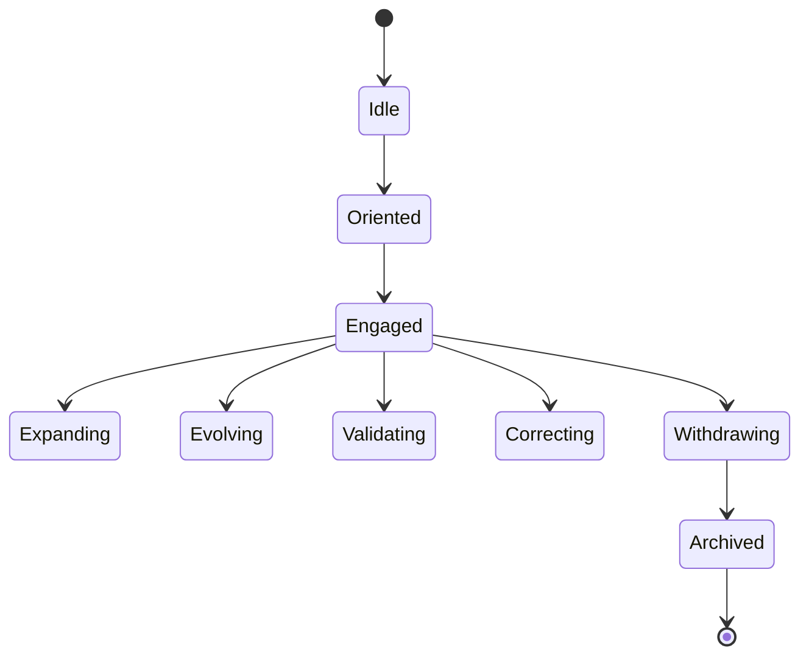
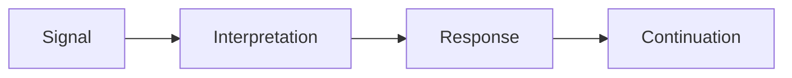
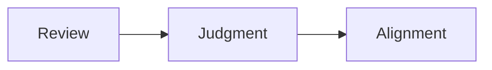
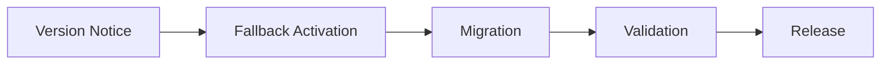
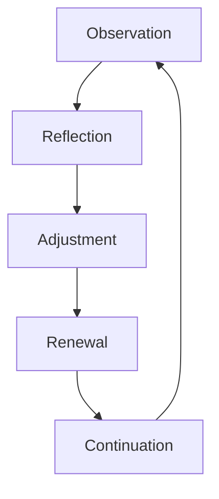
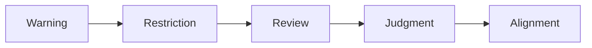

# KWANUS OS — Partner Interaction Protocol (PartnerInteractionProtocol)
The complete interaction logic, behavioral rules, communication flows, and state machine governing how partners and the KWANUS Operating System communicate.

This protocol defines:
- interaction states  
- interaction flows  
- interaction rules  
- partner → OS communication  
- OS → partner communication  
- governance interactions  
- lifecycle interactions  
- compatibility interactions  
- sustainability interactions  
- ceremonial interactions  
- error interactions  
- escalation interactions  

It is the **behavioral backbone** of the partner universe.

---

# 1. Interaction Philosophy

Partner interactions must be:
- predictable  
- governed  
- ceremonial  
- emotionally intelligent  
- state‑aware  
- lifecycle‑aware  
- compatibility‑aware  
- sustainability‑aware  

Interactions are not casual — they are **structured exchanges** within a governed universe.

---

# 2. Interaction States

Partners exist in one of nine interaction states:

Each state has:
- allowed actions  
- forbidden actions  
- required OS responses  
- ceremonial transitions  

---

# 3. Interaction Flow Grammar

All interactions follow a **four‑part grammar**:

## 1. Signal  
Partner sends a request, update, or event.

## 2. Interpretation  
OS interprets the signal through:
- governance  
- compatibility  
- lifecycle  
- sustainability  

## 3. Response  
OS responds with:
- guidance  
- alignment  
- correction  
- confirmation  

## 4. Continuation  
Partner receives next steps.

This grammar is universal.

---

# 4. Partner → OS Communication

Partners may send:

## 1. Capability Requests  
“Requesting new capability.”

## 2. Workflow Events  
“Workflow triggered.”

## 3. Permission Requests  
“Requesting write access.”

## 4. Status Updates  
“Integration health declining.”

## 5. Migration Signals  
“Beginning migration.”

## 6. Deprecation Acknowledgments  
“Preparing for withdrawal.”

## 7. EoS Confirmations  
“Releasing access.”

All partner signals must be:
- structured  
- versioned  
- logged  
- validated  

---

# 5. OS → Partner Communication

The OS responds with:

## 1. Orientation  
“You are here in the lifecycle.”

## 2. Guidance  
“Your next step is…”

## 3. Alignment  
“Governance requires…”

## 4. Correction  
“Your path drifts. Realign.”

## 5. Validation  
“Compatibility confirmed.”

## 6. Restriction  
“Access limited due to…”

## 7. Release  
“Your journey enters memory.”

Tone is always:
- calm  
- ceremonial  
- clear  

---

# 6. Governance Interactions

Governance interactions follow a **three‑step ritual**:

## Review  
Councils examine partner behavior.

## Judgment  
Councils issue decisions.

## Alignment  
Partner receives required actions.

Governance never:
- surprises  
- punishes  
- shames  

Governance always:
- clarifies  
- protects  
- aligns  

---

# 7. Lifecycle Interactions

Each lifecycle stage has specific interaction rules:

## Active  
Full interaction allowed.

## Maintenance  
Partner must respond to OS guidance.

## Deprecation  
Partner receives withdrawal instructions.

## EoS  
Partner receives final closure.

## Post‑EoS  
Partner receives no further interaction.

---

# 8. Compatibility Interactions

Compatibility transitions follow a **five‑step flow**:

Partners must:
- acknowledge notices  
- begin migration  
- complete validation  

OS must:
- provide fallback  
- provide migration guides  
- confirm release  

---

# 9. Sustainability Interactions

Sustainability follows a **renewal loop**:

Partners receive:
- health reports  
- drift warnings  
- renewal instructions  

OS ensures:
- stability  
- balance  
- longevity  

---

# 10. Ceremonial Interactions

Ceremony governs transitions:

## Activation  
A pulse of light + welcome message.

## Expansion  
Unfolding animation + capability blessing.

## Evolution  
Rising illumination + tier shift.

## Deprecation  
Soft dimming + dignified withdrawal.

## EoS  
Stillness + closing gate.

## Memory  
Archive knot + final message.

---

# 11. Error Interactions

Errors are treated as **misalignments**, not failures.

OS responds with:
- calm correction  
- clear guidance  
- ceremonial tone  

Examples:

**Compatibility Error**  
“The strands misalign. Begin migration.”

**Permission Error**  
“The gate remains closed. Request alignment.”

**Workflow Error**  
“The thread breaks. Reweave the pattern.”

---

# 12. Escalation Interactions

Escalation occurs when:
- violations repeat  
- sustainability collapses  
- compatibility breaks  
- governance is ignored  

Escalation flow:

Escalation is always:
- ceremonial  
- predictable  
- governed  

---

# 13. Summary

The Partner Interaction Protocol provides:
- the behavioral logic  
- the communication grammar  
- the interaction states  
- the governance flows  
- the lifecycle flows  
- the compatibility flows  
- the sustainability flows  
- the ceremonial transitions  

…that define how partners and the OS communicate.

It is the **interaction backbone** of the partner universe.
