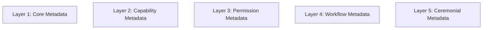

# KWANUS OS — Partner Metadata Specification (PartnerMetadataSpec)
The complete metadata schema, field definitions, structures, lineage rules, and ceremonial metadata lifecycle of the KWANUS Operating System partner universe.

This specification defines:
- metadata philosophy  
- metadata layers  
- metadata schema  
- metadata fields  
- metadata categories  
- metadata lineage  
- metadata immutability  
- metadata evolution  
- metadata validation  
- metadata governance  
- metadata protection  
- metadata archival  

It is the **metadata backbone** of the partner universe.

---

# 1. Metadata Philosophy

Metadata in the partner universe must be:
- structured  
- ceremonial  
- emotionally intelligent  
- lifecycle-aware  
- trust-aware  
- compatibility-aware  
- immutable where required  
- evolvable where allowed  
- governed  
- protected  

Metadata is not storage — it is **cosmic memory**.

---

# 2. Metadata Layers

Partner metadata is organized into **five layers**:



Each layer corresponds to a dimension of partner existence.

---

# 3. Core Metadata

Core Metadata includes:
- `partner_id`  
- `partner_name`  
- `partner_type`  
- `partner_tier`  
- `trust_level`  
- `lifecycle_stage`  
- `creation_timestamp`  
- `activation_timestamp`  
- `archival_timestamp` (if applicable)  

Core Metadata is:
- immutable except through ceremony  
- required for all partners  

---

# 4. Capability Metadata

Capability Metadata includes:
- `capabilities_granted`  
- `capabilities_used`  
- `capability_version`  
- `capability_lineage`  
- `capability_last_updated`  
- `capability_governance_decisions`  

Capability Metadata evolves through:
- expansion  
- evolution  
- governance approval  

---

# 5. Permission Metadata

Permission Metadata includes:
- `permissions_granted`  
- `permissions_used`  
- `permission_ceiling`  
- `permission_lineage`  
- `permission_last_updated`  
- `permission_governance_decisions`  

Permission Metadata is governed by:
- SCO  
- trust score  
- lifecycle stage  

---

# 6. Workflow Metadata

Workflow Metadata includes:
- `workflows_owned`  
- `workflows_triggered`  
- `workflow_version`  
- `workflow_lineage`  
- `workflow_health`  
- `workflow_last_updated`  
- `workflow_compatibility`  

Workflow Metadata evolves through:
- integration  
- validation  
- sustainability cycles  

---

# 7. Ceremonial Metadata

Ceremonial Metadata includes:
- `rites_completed`  
- `rites_pending`  
- `rites_failed`  
- `ceremonial_lineage`  
- `ceremonial_symbols`  
- `ceremonial_timestamps`  

Ceremony defines metadata transitions.

---

# 8. Metadata Categories

Metadata is categorized into:

## 1. Immutable Metadata  
- `partner_id`  
- `creation_timestamp`  
- `origin_lineage`  

## 2. Semi‑Mutable Metadata  
- `tier`  
- `trust_level`  
- `lifecycle_stage`  

## 3. Mutable Metadata  
- `capabilities`  
- `permissions`  
- `workflows`  
- `sustainability metrics`  

## 4. Ceremonial Metadata  
- `rites`  
- `symbols`  
- `ceremonial states`  

---

# 9. Metadata Schema (Full)

```json
{
  "partner_metadata": {
    "core": {
      "partner_id": "string",
      "partner_name": "string",
      "partner_type": "string",
      "partner_tier": "int",
      "trust_level": "int",
      "lifecycle_stage": "string",
      "creation_timestamp": "datetime",
      "activation_timestamp": "datetime",
      "archival_timestamp": "datetime | null"
    },
    "capabilities": {
      "list": "array<capability>",
      "version": "string",
      "lineage": "array<capability_event>",
      "last_updated": "datetime",
      "governance_decisions": "array<decision>"
    },
    "permissions": {
      "list": "array<permission>",
      "ceiling": "string",
      "lineage": "array<permission_event>",
      "last_updated": "datetime",
      "governance_decisions": "array<decision>"
    },
    "workflows": {
      "list": "array<workflow>",
      "version": "string",
      "lineage": "array<workflow_event>",
      "health": "int",
      "last_updated": "datetime",
      "compatibility": "string"
    },
    "ceremony": {
      "rites_completed": "array<rite>",
      "rites_pending": "array<rite>",
      "rites_failed": "array<rite>",
      "lineage": "array<ceremonial_event>",
      "symbols": "array<symbol>",
      "timestamps": "array<ceremonial_timestamp>"
    }
  }
}
```

---

# 10. Metadata Lineage

Metadata lineage tracks:
- origin  
- expansions  
- evolutions  
- migrations  
- validations  
- remediations  
- deprecations  
- EoS  
- archival  

Lineage is the **story of the metadata**.

---

# 11. Metadata Immutability

Immutable metadata:
- cannot be changed  
- cannot be overwritten  
- cannot be deleted  

Immutable fields include:
- `partner_id`  
- `creation_timestamp`  
- `origin_lineage`  

---

# 12. Metadata Evolution

Metadata evolves through:
- capability expansion  
- permission updates  
- workflow integration  
- lifecycle transitions  
- trust changes  
- ceremonial rites  

Evolution is always:
- governed  
- validated  
- documented  

---

# 13. Metadata Validation

Validation occurs at:
- onboarding  
- expansion  
- evolution  
- migration  
- remediation  
- deprecation  

Validation checks:
- schema integrity  
- signature integrity  
- lineage integrity  
- compatibility integrity  
- governance integrity  

---

# 14. Metadata Governance

Governance bodies oversee metadata:

- **TSC** → structure  
- **SCO** → permissions  
- **ERC** → workflows  
- **CGB** → ecosystem  

Governance ensures:
- accuracy  
- authenticity  
- alignment  

---

# 15. Metadata Protection

Metadata is protected through:
- signature validation  
- boundary shielding  
- lineage verification  
- permission ceilings  
- capability ceilings  
- workflow ceilings  

Metadata cannot be:
- forged  
- overwritten  
- corrupted  

---

# 16. Metadata Archival

Archived metadata includes:
- final signature  
- final lineage  
- final metadata snapshot  
- ceremonial closure  

Archived metadata is:
- immutable  
- preserved  
- honored  

---

# 17. Summary

The Partner Metadata Specification provides the structural memory of the partner universe. It defines how information is captured, evolved, and archived, ensuring that a partner's journey remains immutable and verifiable throughout its cosmic existence.
