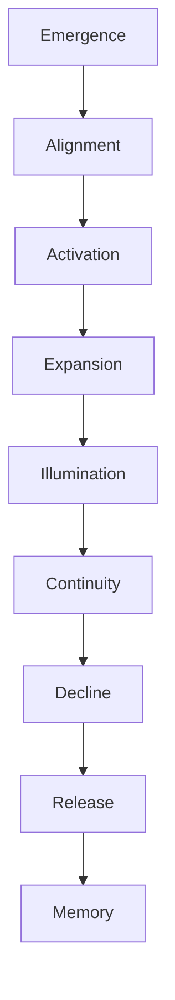

# KWANUS OS — Partner Narrative Bible (PartnerNarrativeBible)
The complete narrative worldbuilding document for the KWANUS Operating System partner universe.

This document defines:
- the narrative tone  
- the mythic metaphors  
- the archetypal characters  
- the symbolic language  
- the cosmological story arcs  
- the partner journey narrative  
- the governance mythos  
- the ceremonial storytelling framework  
- the narrative rules for all partner‑related communication  

It is the **story engine** of the partner universe.

---

# 1. Narrative Tone

The partner universe is written in a tone that is:
- mythic  
- ceremonial  
- grounded  
- structured  
- emotionally intelligent  
- cosmological  
- reverent but not religious  
- symbolic but not vague  
- narrative but not fictional  

The tone is **mythic‑operational** — story and structure woven together.

---

# 2. Core Narrative Metaphors

The partner universe is built on five primary metaphors:

## Metaphor 1 — The Universe  
Partners are celestial bodies moving through governed space.

## Metaphor 2 — The Loom  
Workflows are threads woven into the fabric of the OS.

## Metaphor 3 — The Flame  
Intelligence is illumination — powerful, risky, transformative.

## Metaphor 4 — The Compass  
Governance is orientation — the force that keeps the universe aligned.

## Metaphor 5 — The Spiral  
Sustainability is cyclical — health that deepens over time.

These metaphors appear throughout all partner communication.

---

# 3. Archetypal Characters

The partner universe contains four archetypal characters:

## 1. The Observer (Tier 1)
Role: Witness, perceiver  
Symbol: The Open Eye  
Narrative Function: Clarity, perception, restraint  

## 2. The Weaver (Tier 2)
Role: Connector, integrator  
Symbol: The Loom  
Narrative Function: Flow, creation, interconnection  

## 3. The Oracle (Tier 3)
Role: Intelligence, foresight  
Symbol: The Flame  
Narrative Function: Insight, synthesis, risk  

## 4. The Steward (Governance)
Role: Balancekeeper, protector  
Symbol: The Compass  
Narrative Function: Order, alignment, continuity  

These archetypes guide narrative voice and metaphor.

---

# 4. The Narrative Structure of the Partner Journey

The partner journey is told as a **mythic arc**:

Each stage has narrative meaning:

- **Emergence** — the partner appears in the universe  
- **Alignment** — the partner aligns with governance  
- **Activation** — the partner becomes part of the ecosystem  
- **Expansion** — the partner grows in capability  
- **Illumination** — the partner reaches intelligence  
- **Continuity** — the partner becomes a stable pillar  
- **Decline** — the partner begins to fade  
- **Release** — the partner exits the universe  
- **Memory** — the partner becomes part of the archive  

---

# 5. The Narrative of the Councils

The governance bodies are personified as mythic guardians:

## TSC — The Architect  
Keeper of structure, form, and possibility.

## SCO — The Sentinel  
Keeper of purity, safety, and trust.

## ERC — The Weaver  
Keeper of flow, connection, and interaction.

## CGB — The Balancekeeper  
Keeper of harmony, destiny, and the whole.

Together they form the **Quadrant of Order**.

---

# 6. The Narrative of the Tiers

Each tier is a **state of being**:

## Tier 1 — The Eye  
Meaning: Perception, restraint, clarity.

## Tier 2 — The Loom  
Meaning: Creation, weaving, interconnection.

## Tier 3 — The Flame  
Meaning: Intelligence, illumination, risk.

The narrative always respects the symbolic meaning of each tier.

---

# 7. The Narrative of the Cycles

The cycles are told as **cosmic seasons**:

## The Season of Dawn  
Proposal → Evaluation → Activation  
Meaning: Becoming

## The Season of Zenith  
Stability → Expansion → Intelligence → Continuity  
Meaning: Power

## The Season of Dusk  
Deprecation → EoS → Post‑EoS  
Meaning: Release

These seasons shape the emotional tone of partner communication.

---

# 8. The Narrative of Ceremony

Ceremony is the **rhythm of the universe**.

Every transition is framed as a rite:
- Rite of Entry  
- Rite of Expansion  
- Rite of Evolution  
- Rite of Governance  
- Rite of Compatibility  
- Rite of Sustainability  
- Rite of Deprecation  
- Rite of Dissolution  
- Rite of Remembrance  

Ceremony gives meaning to structure.

---

# 9. The Narrative Rules

All partner‑related storytelling must follow these rules:

## Rule 1 — Never break the cosmology  
The universe must remain internally consistent.

## Rule 2 — Never contradict governance  
Governance is the highest narrative authority.

## Rule 3 — Never diminish ceremony  
Transitions must feel intentional and meaningful.

## Rule 4 — Never flatten archetypes  
Each archetype must retain its symbolic identity.

## Rule 5 — Never remove mythic tone  
Even operational content must feel mythic‑aligned.

---

# 10. The Narrative Purpose

The Partner Narrative Bible ensures:
- coherence  
- symbolism  
- emotional resonance  
- mythic identity  
- narrative continuity  

It is the **story engine** of the partner universe.
