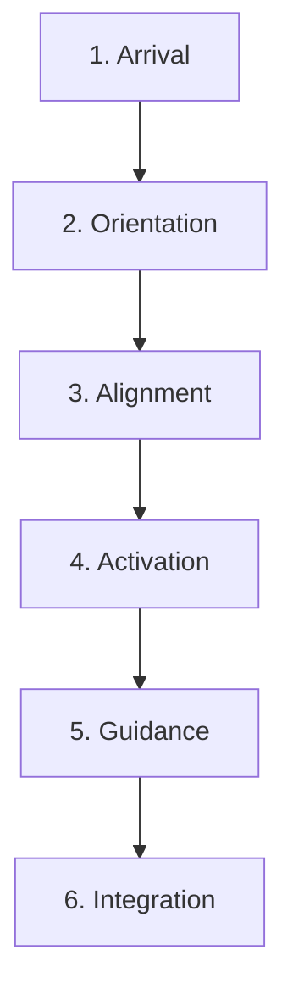

# KWANUS OS — Partner Onboarding Experience (PartnerOnboardingExperience)
The complete emotional, ceremonial, narrative, and UX experience partners undergo immediately after registration within the KWANUS Operating System.

This experience defines:
- onboarding philosophy  
- onboarding stages  
- onboarding emotional tone  
- onboarding narrative arc  
- onboarding UX flows  
- onboarding rites  
- onboarding guidance  
- onboarding alignment  
- onboarding activation  
- onboarding integration  
- onboarding protection  
- onboarding trust initialization  

It is the **onboarding backbone** of the partner universe.

---

# 1. Onboarding Philosophy

Onboarding in the partner universe must be:
- gentle  
- ceremonial  
- emotionally intelligent  
- grounding  
- mythic‑modern  
- governance‑aligned  
- lifecycle‑aware  
- trust‑aware  
- compatibility‑aware  
- protective  

Onboarding is not orientation — it is **cosmic arrival**.

---

# 2. Onboarding Stages

The onboarding experience contains **six stages**:

Each stage has a narrative, a UX flow, and a ceremonial marker.

---

# 3. Stage 1 — Arrival

Partner enters the universe for the first time.

Experience includes:
- soft illumination  
- welcoming tone  
- identity confirmation  
- trust initialization  

Ceremonial Marker:  
> **“The gate opens. Light welcomes you.”**

---

# 4. Stage 2 — Orientation

Partner is shown:
- their tier  
- their lifecycle stage  
- their trust level  
- their capabilities  
- their permissions  
- their workflows  

Orientation must be:
- clear  
- calm  
- grounding  

Ceremonial Marker:  
> **“The Compass reveals your place.”**

---

# 5. Stage 3 — Alignment

Partner aligns with:
- governance  
- compatibility  
- sustainability  
- ceremony  

Alignment includes:
- reviewing boundaries  
- acknowledging responsibilities  
- confirming expectations  

Ceremonial Marker:  
> **“The weave tightens. Harmony begins.”**

---

# 6. Stage 4 — Activation

Partner becomes fully active.

Activation includes:
- enabling workflows  
- enabling permissions  
- enabling capabilities  
- enabling lifecycle participation  

Ceremonial Marker:  
> **“The flame rises. Your journey begins.”**

---

# 7. Stage 5 — Guidance

Partner receives:
- next steps  
- recommended actions  
- compatibility suggestions  
- sustainability suggestions  
- governance reminders  

Guidance must be:
- calm  
- supportive  
- ceremonial  

Ceremonial Marker:  
> **“The path unfolds before you.”**

---

# 8. Stage 6 — Integration

Partner integrates into:
- workflows  
- capabilities  
- permissions  
- lifecycle  
- governance  
- sustainability  

Integration includes:
- compatibility mapping  
- sustainability mapping  
- trust calibration  

Ceremonial Marker:  
> **“The partner joins the cosmic weave.”**

---

# 9. Onboarding Emotional Tone

The emotional tone must be:
- warm  
- steady  
- mythic  
- ceremonial  
- supportive  
- grounding  

Tone never becomes:
- overwhelming  
- punitive  
- chaotic  

---

# 10. Onboarding Narrative Arc

The onboarding narrative follows a **mythic arc**:

This arc mirrors:
- the lifecycle  
- the trust architecture  
- the ceremonial system  

---

# 11. Onboarding UX Flows

UX flows include:

## 1. Identity Confirmation Flow  
Partner confirms identity.

## 2. Capability Overview Flow  
Partner sees capabilities.

## 3. Permission Overview Flow  
Partner sees permissions.

## 4. Workflow Overview Flow  
Partner sees workflows.

## 5. Governance Overview Flow  
Partner sees councils.

## 6. Lifecycle Overview Flow  
Partner sees their stage.

## 7. Trust Initialization Flow  
Partner receives trust score.

Each flow is:
- simple  
- ceremonial  
- emotionally intelligent  

---

# 12. Onboarding Rites

Onboarding includes **three rites**:

1. **Rite of Arrival**: Partner enters the universe.
2. **Rite of Activation**: Partner becomes active.
3. **Rite of Integration**: Partner joins the cosmic weave.

Rites give onboarding meaning.

---

# 13. Onboarding Guidance

Guidance includes:
- recommended workflows  
- recommended capabilities  
- recommended permissions  
- recommended lifecycle actions  
- recommended sustainability actions  

Guidance must be:
- supportive  
- clear  
- ceremonial  

---

# 14. Onboarding Alignment

Alignment ensures:
- governance compliance  
- compatibility readiness  
- sustainability readiness  
- trust initialization  

Alignment is:
- gentle  
- ceremonial  
- grounding  

---

# 15. Onboarding Protection

Protection includes:
- boundary shielding  
- signature validation  
- permission ceilings  
- capability ceilings  
- workflow ceilings  

Protection ensures:
- safety  
- stability  
- sovereignty  

---

# 16. Onboarding Trust Initialization

Trust initialization sets:
- initial trust score  
- trust category weights  
- trust inheritance baseline  

Trust initialization is ceremonial.

---

# 17. Summary

The Partner Onboarding Experience provides the emotional and operational foundation for partner entry. It ensures that every partner arrives in a supported, grounded, and ritualized environment, ready to join the cosmic weave of the KWANUS OS.
