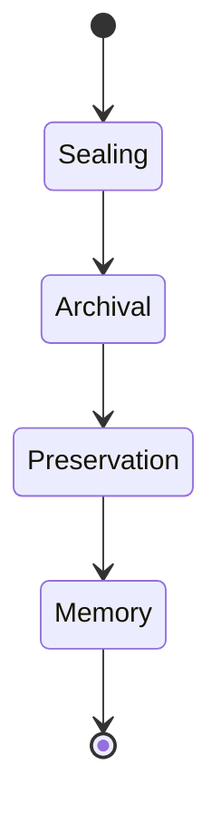

# KWANUS OS — Partner Post‑EoS Framework (PartnerPostEoSFramework)
The complete post‑End‑of‑Service (Post‑EoS) system, archival logic, memory preservation, lineage sealing, and ceremonial afterlife rites of the KWANUS Operating System partner universe.

This framework defines:
- post‑EoS philosophy  
- post‑EoS categories  
- post‑EoS states  
- post‑EoS flows  
- post‑EoS lineage  
- post‑EoS governance  
- post‑EoS validation  
- post‑EoS protection  
- post‑EoS archival  
- post‑EoS memory  
- ceremonial post‑EoS rites  

It is the **afterlife backbone** of the partner universe.

---

# 1. Post‑EoS Philosophy

Post‑EoS in the partner universe must be:
- dignified  
- ceremonial  
- emotionally intelligent  
- lineage‑preserving  
- memory‑honoring  
- immutable  
- protected  
- final  

Post‑EoS is not disappearance — it is **cosmic remembrance**.

---

# 2. Post‑EoS Categories

The partner universe contains **four post‑EoS categories**:

Each category governs a different dimension of archival.

---

# 3. Post‑EoS States

Post‑EoS follows **four states**:

- **Sealing**: Partner’s lineage is finalized and locked.
- **Archival**: Partner’s terminal metadata enters the cosmic vault.
- **Preservation**: The partner's story is shielded from any future corruption.
- **Memory**: The partner becomes an eternal record within the OS fabric.

---

# 4. Post‑EoS Flows

Post‑EoS flows follow a **five‑step afterlife grammar**:

1. **Closure**: Final acknowledgement of EoS completion.
2. **Sealing**: Lineage is locked and signed for the final time.
3. **Archival**: Metadata snapshot is moved to cold, immutable storage.
4. **Preservation**: Integrity checks are established for eternal rest.
5. **Memory**: The partner is woven into the mythic story of the universe.

---

# 5. Post‑EoS Lineage & Governance

- **Lineage**: Immutable record including the final signature, metadata snapshot, and archival timestamp.
- **Governance**: TSC, SCO, and ERC oversee the final sealing of their respective domains, with the CGB providing the final authority for archival completion.

---

# 6. Post‑EoS Protection & Archival

- **Protection**: Ensured through boundary shielding and signature locking. Metadata is made immutable and protected against any future modification or deletion.
- **Archival**: The vault contains the complete narrative, functional, and ceremonial history of the partner, honored as a permanent contribution to the ecosystem.

---

# 7. Ceremonial Post‑EoS Rites

The final transition into eternity is marked by these rites:

- **Rite of Closure**: “The flame fades. The journey completes.”
- **Rite of Sealing**: “The thread is tied. The pattern is fixed.”
- **Rite of Archival**: “The name enters the vault of memory.”
- **Rite of Preservation**: “The story is guarded. Integrity endures.”
- **Rite of Eternal Memory**: “The partner becomes part of the cosmic weave.”

---

# 8. Summary

The Partner Post-EoS Framework provides the architectural and ceremonial system for eternal remembrance. It ensures that every partner who participates in the KWANUS OS is never forgotten, but remains preserved and honored in the cosmic archive for all time.
