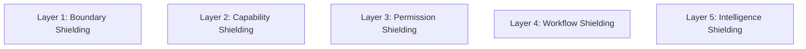
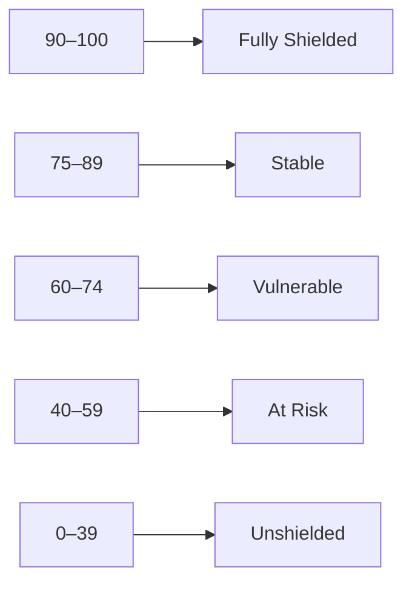

# KWANUS OS — Partner Protection Protocol (PartnerProtectionProtocol)
The complete protection, shielding, boundary‑hardening, misuse‑prevention, and intrusion‑prevention framework governing partner interactions within the KWANUS Operating System.

This protocol defines:
- protection philosophy  
- protection layers  
- shield mechanisms  
- boundary hardening  
- misuse prevention  
- intrusion prevention  
- containment fields  
- protective audits  
- protective scoring  
- protective escalation  
- ceremonial protection rituals  

It is the **shield backbone** of the partner universe.

---

# 1. Protection Philosophy

Protection in the partner universe must be:
- preventative  
- layered  
- ceremonial  
- emotionally intelligent  
- sovereignty‑preserving  
- governance‑driven  
- lifecycle‑aligned  
- sustainability‑aligned  

Protection is not restriction — it is **defense of the universe’s integrity and emotional safety**.

---

# 2. Protection Layers

The partner universe uses **five protection layers**:

Each layer protects a different dimension of the OS.

---

# 3. Boundary Shielding

Boundary shielding protects the **outer perimeter** of the partner universe.

Includes:
- partner authentication  
- partner identity verification  
- tier verification  
- capability boundary checks  
- permission boundary checks  

Boundary shielding ensures:
- no unauthorized partner enters  
- no partner exceeds its tier  

---

# 4. Capability Shielding

Capability shielding protects the **functional perimeter**.

Includes:
- capability whitelisting  
- capability rate limiting  
- capability throttling  
- capability anomaly detection  
- capability quarantine  

Capability shielding ensures:
- no capability is misused  
- no capability is overloaded  
- no capability is invoked outside governance  

---

# 5. Permission Shielding

Permission shielding protects the **access perimeter**.

Includes:
- permission ceilings  
- permission drift detection  
- permission revocation  
- permission quarantine  
- permission rollback  

Permission shielding ensures:
- no unauthorized access  
- no permission escalation  
- no permission misuse  

---

# 6. Workflow Shielding

Workflow shielding protects the **flow perimeter**.

Includes:
- workflow anomaly detection  
- workflow throttling  
- workflow freeze  
- workflow disable  
- workflow quarantine  

Workflow shielding ensures:
- no workflow overload  
- no workflow incompatibility  
- no workflow corruption  

---

# 7. Intelligence Shielding

Intelligence shielding protects the **highest‑risk perimeter**.

Includes:
- intelligence runtime pause  
- intelligence runtime throttle  
- intelligence runtime disable  
- intelligence quarantine  
- intelligence rollback  

Intelligence shielding ensures:
- no intelligence overreach  
- no intelligence misuse  
- no intelligence instability  

---

# 8. Misuse Prevention

Misuse prevention detects and prevents:
- unauthorized access  
- unauthorized retention  
- unauthorized export  
- unauthorized workflow triggers  
- unauthorized capability use  
- unauthorized intelligence activation  

Misuse prevention uses:
- pattern recognition  
- anomaly detection  
- drift detection  
- behavioral modeling  

---

# 9. Intrusion Prevention

Intrusion prevention protects against:
- external threats  
- partner impersonation  
- partner spoofing  
- capability injection  
- workflow injection  
- permission injection  

Intrusion prevention uses:
- cryptographic signatures  
- tier‑locked authentication  
- capability‑locked authentication  
- workflow‑locked authentication  

---

# 10. Containment Fields

Containment fields activate when:
- violations escalate  
- misuse is detected  
- intrusion is detected  
- intelligence destabilizes  

Containment fields include:
- capability containment  
- workflow containment  
- permission containment  
- intelligence containment  
- partner quarantine  

Containment is always:
- ceremonial  
- governed  
- documented  

---

# 11. Protective Audits

Protective audits occur on three cycles:

## Continuous  
- boundary checks  
- permission drift  
- workflow anomalies  

## Quarterly  
- capability health  
- workflow health  
- intelligence stability  

## Annual  
- full protection review  
- boundary hardening  
- sustainability review  

---

# 12. Protective Scoring

Partners receive a **Protection Score** (0–100):

Scores determine:
- shielding intensity  
- governance attention  
- containment readiness  

---

# 13. Protective Escalation

Protection escalation follows a **four‑stage path**:

## Stage 1 — Shield Activation  
> “The boundary brightens. A shield forms.”

## Stage 2 — Shield Reinforcement  
> “The weave tightens. Protection strengthens.”

## Stage 3 — Containment Field  
> “The flame dims. The loom stills.”

## Stage 4 — Stage 4 — Quarantine  
> “The circle closes. Isolation begins.”

---

# 14. Ceremonial Protection Rituals

Protection is ritualized:

## Boundary Ritual  
> “The gate stands firm.”

## Capability Ritual  
> “The loom holds its pattern.”

## Permission Ritual  
> “The lock remains sealed.”

## Workflow Ritual  
> “The thread is guarded.”

## Intelligence Ritual  
> “The flame is contained.”

## Containment Ritual  
> “The circle closes.”

## Restoration Ritual  
> “The weave strengthens.”

---

# 15. Summary

The Partner Protection Protocol provides:
- the protection layers  
- the shielding mechanisms  
- the misuse prevention  
- the intrusion prevention  
- the containment fields  
- the protective audits  
- the protective scoring  
- the escalation  
- the ceremonial rituals  

…that ensure the partner universe remains **shielded, sovereign, and emotionally safe**.

It is the **protection backbone** of the KWANUS OS partner system.
