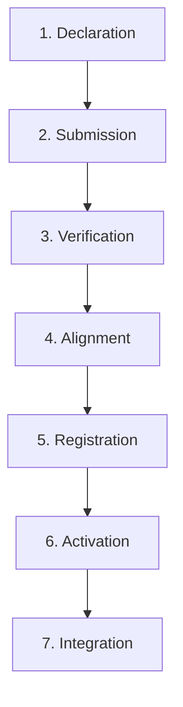
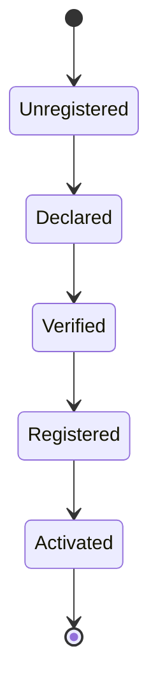
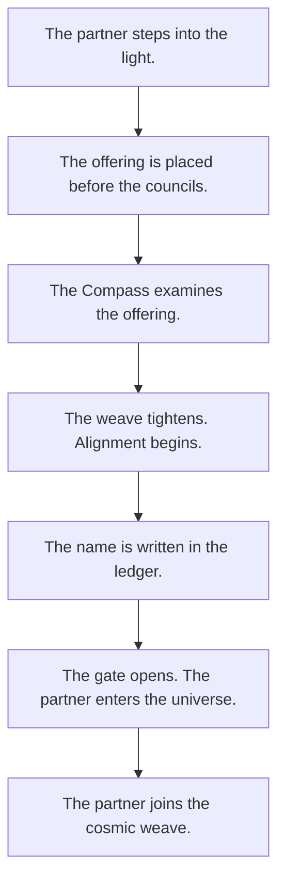

# KWANUS OS — Partner Registration Protocol (PartnerRegistrationProtocol)
The complete step-by-step, ceremonial, governance-aligned protocol for registering partners into the KWANUS Operating System.

This protocol defines:
- registration philosophy  
- registration prerequisites  
- registration stages  
- registration rites  
- registration validations  
- registration governance  
- registration states  
- registration transitions  
- registration protection  
- registration lineage  
- ceremonial registration flow  

It is the **registration backbone** of the partner universe.

---

# 1. Registration Philosophy

Registration in the partner universe must be:
- intentional  
- ceremonial  
- emotionally intelligent  
- governance-driven  
- lifecycle-aware  
- trust-aware  
- compatibility-aware  
- protected  
- validated  

Registration is not onboarding — it is **cosmic initiation**.

---

# 2. Registration Prerequisites

A partner must meet the following prerequisites:

## Identity Prerequisites
- partner identity declared  
- partner type defined  
- partner tier proposed  

## Capability Prerequisites
- initial capabilities declared  
- capability boundaries acknowledged  

## Permission Prerequisites
- requested permissions declared  
- permission ceilings acknowledged  

## Workflow Prerequisites
- workflow intentions declared  

## Ceremonial Prerequisites
- Rite of Declaration completed  

---

# 3. Registration Stages

The registration process contains **seven stages**:

---

# 4. Stage 1 — Declaration

Partner declares:
- identity  
- purpose  
- capabilities  
- permissions  
- workflows  

Ceremonial Marker:  
> **“The partner steps into the light.”**

---

# 5. Stage 2 — Submission

Partner submits:
- identity packet  
- capability packet  
- permission packet  
- workflow packet  

Governance receives the submission.

Ceremonial Marker:  
> **“The offering is placed before the councils.”**

---

# 6. Stage 3 — Verification

Verification includes:
- identity verification  
- signature verification  
- capability verification  
- permission verification  
- workflow verification  
- compatibility verification  

Governance bodies involved:
- **SCO**  
- **TSC**  
- **ERC**  

Ceremonial Marker:  
> **“The Compass examines the offering.”**

---

# 7. Stage 4 — Alignment

Partner must align with:
- governance  
- compatibility  
- lifecycle  
- sustainability  
- ceremony  

Alignment includes:
- resolving conflicts  
- adjusting capabilities  
- adjusting permissions  
- adjusting workflows  

Ceremonial Marker:  
> **“The weave tightens. Alignment begins.”**

---

# 8. Stage 5 — Registration

The registry creates a **canonical entry**.

Registry entry includes:
- core metadata  
- capability metadata  
- permission metadata  
- workflow metadata  
- ceremonial metadata  
- registry signatures  
- registry lineage  

Ceremonial Marker:  
> **“The name is written in the ledger.”**

---

# 9. Stage 6 — Activation

Partner becomes active.

Activation includes:
- enabling workflows  
- enabling permissions  
- enabling capabilities  
- enabling lifecycle participation  

Ceremonial Marker:  
> **“The gate opens. The partner enters the universe.”**

---

# 10. Stage 7 — Integration

Partner integrates into:
- workflows  
- capabilities  
- permissions  
- lifecycle  
- governance  
- sustainability  

Integration includes:
- compatibility mapping  
- sustainability mapping  
- trust initialization  

Ceremonial Marker:  
> **“The partner joins the cosmic weave.”**

---

# 11. Registration Rites

Registration includes **five rites**:

1. **Rite 1 — Declaration**: Partner declares identity.
2. **Rite 2 — Submission**: Partner submits packets.
3. **Rite 3 — Verification**: Governance examines.
4. **Rite 4 — Alignment**: Partner adjusts/aligns.
5. **Rite 5 — Activation**: Partner enters the universe.

Each rite is required.

---

# 12. Registration Validations

Validation checks include:
- identity integrity  
- signature integrity  
- lineage integrity  
- capability integrity  
- permission integrity  
- workflow integrity  
- compatibility integrity  
- governance integrity  

Validation must pass before registration.

---

# 13. Registration Governance

Governance bodies involved:

- **SCO** → permissions  
- **TSC** → structure  
- **ERC** → workflows  
- **CGB** → ecosystem  

Governance ensures:
- safety  
- alignment  
- authenticity  

---

# 14. Registration States

Partners move through **five registration states**:

State transitions are:
- governed  
- ceremonial  
- documented  

---

# 15. Registration Protection

Registration is protected through:
- boundary shielding  
- signature validation  
- lineage verification  
- permission ceilings  
- capability ceilings  
- workflow ceilings  

Registration cannot be:
- forged  
- bypassed  
- corrupted  

---

# 16. Registration Lineage

Registration lineage includes:
- declaration event  
- submission event  
- verification event  
- alignment event  
- registration event  
- activation event  

Lineage is preserved forever.

---

# 17. Ceremonial Registration Flow

The full ceremonial flow:

This is the **mythic arc** of registration.

---

# 18. Summary

The Partner Registration Protocol provides the step-by-step path for partner initiation. It ensures that every entrance into the KWANUS OS is intentional, validated, and ritualized, maintaining the structural and emotional integrity of the universe.
