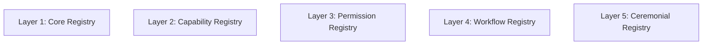
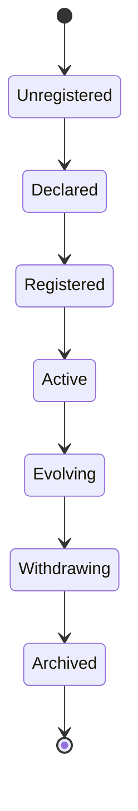

# KWANUS OS — Partner Registry Specification (PartnerRegistrySpec)
The complete registry architecture, indexing logic, lookup rules, registration lifecycle, and ceremonial registration system of the KWANUS Operating System partner universe.

This specification defines:
- registry philosophy  
- registry architecture  
- registry layers  
- registry entries  
- registry indexing  
- registry lookup rules  
- registry validation  
- registry lifecycle  
- registry governance  
- registry protection  
- registry archival  
- ceremonial registration rites  

It is the **registry backbone** of the partner universe.

---

# 1. Registry Philosophy

The Partner Registry must be:
- authoritative  
- canonical  
- ceremonial  
- emotionally intelligent  
- lifecycle-aware  
- trust-aware  
- compatibility-aware  
- immutable where required  
- governed  
- protected  

The registry is not a database — it is the **cosmic ledger** of partner existence.

---

# 2. Registry Architecture

The registry is composed of **five structural layers**:



Each layer corresponds to a metadata layer.

---

# 3. Registry Entry Structure

Each partner has a **Registry Entry**, composed of:

```json
{
  "registry_entry": {
    "core_metadata": "PartnerMetadataCore",
    "capability_metadata": "PartnerMetadataCapability",
    "permission_metadata": "PartnerMetadataPermission",
    "workflow_metadata": "PartnerMetadataWorkflow",
    "ceremonial_metadata": "PartnerMetadataCeremony",
    "registry_signatures": "array<signature>",
    "registry_lineage": "array<registry_event>",
    "registry_state": "string"
  }
}
```

Registry entries are:
- canonical  
- versioned  
- lineage-tracked  
- ceremony-bound  

---

# 4. Registry Indexing

Registry indexing uses **five index types**:

## 1. Identity Index  
Indexed by `partner_id`.

## 2. Capability Index  
Indexed by capability signatures.

## 3. Permission Index  
Indexed by permission ceilings.

## 4. Workflow Index  
Indexed by workflow lineage.

## 5. Ceremonial Index  
Indexed by rites completed.

Indexes must be:
- unique  
- deterministic  
- immutable  

---

# 5. Registry Lookup Rules

Lookups follow a **three-step lookup grammar**:


## Query  
Partner or OS requests registry data.

## Resolve  
Registry resolves through the relevant index (Identity, Capability, Permission, Workflow, or Ceremonial).

## Return  
Registry returns requested data (Full entry, Partial entry, Lineage, or Validation status).

Lookups must be:
- fast  
- deterministic  
- governed  

---

# 6. Registry Validation

Registry validation occurs when:
- partner is created  
- partner expands  
- partner evolves  
- partner migrates  
- partner remediates  
- partner deprecates  
- partner reaches EoS  

Validation checks:
- schema integrity  
- signature integrity  
- lineage integrity  
- compatibility integrity  
- governance integrity  

---

# 7. Registry Lifecycle

The registry lifecycle has **seven stages**:



---

# 8. Registry Governance

Governance bodies oversee registry operations:

- **TSC** → structure  
- **SCO** → permissions  
- **ERC** → workflows  
- **CGB** → ecosystem  

Governance ensures:
- accuracy  
- authenticity  
- alignment  

---

# 9. Registry Protection

Registry protection includes:
- signature validation  
- lineage verification  
- boundary shielding  
- permission ceilings  
- capability ceilings  
- workflow ceilings  

Registry entries cannot be:
- forged  
- overwritten  
- corrupted  

---

# 10. Registry Signatures

Registry signatures include:
- identity signature  
- capability signature  
- permission signature  
- workflow signature  
- ceremonial signature  

Signatures ensure:
- authenticity  
- immutability  
- trust  

---

# 11. Registry Lineage

Registry lineage tracks:
- creation  
- activation  
- expansions  
- evolutions  
- migrations  
- validations  
- remediations  
- deprecations  
- EoS  
- archival  

Lineage is the **story of the registry entry**.

---

# 12. Registry State

Registry state mirrors lifecycle:

**Registered** → **Active** → **Evolving** → **Withdrawing** → **Archived**

State transitions are:
- governed  
- ceremonial  
- documented  

---

# 13. Ceremonial Registration Rites

Registration is ritualized:

## Rite of Declaration  
Partner declares identity.

## Rite of Registration  
Registry entry is created.

## Rite of Activation  
Entry becomes active.

## Rite of Expansion  
Entry grows in capability.

## Rite of Evolution  
Entry ascends in tier.

## Rite of Release  
Entry prepares for EoS.

## Rite of Memory  
Entry is archived.

---

# 14. Summary

The Partner Registry Specification provides the architectural foundation for partner discovery and persistence. It ensures that every partner's presence in the KWANUS OS is authoritative, documented, and honored throughout its entire existence.
