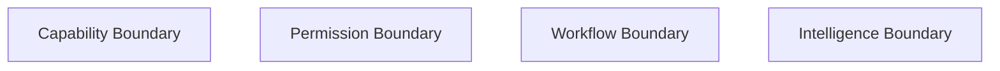
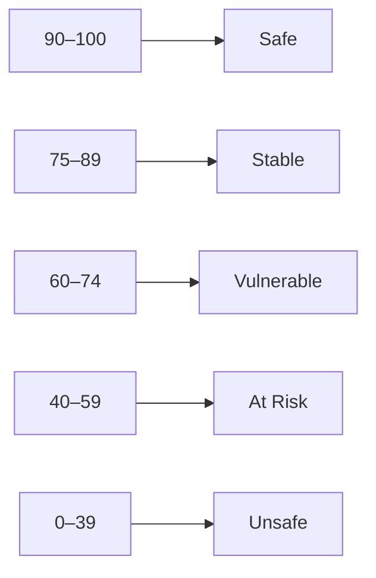

# KWANUS OS — Partner Safety & Integrity Framework (PartnerSafetyIntegrityFramework)
The complete safety, integrity, trust, and protection architecture governing partner behavior within the KWANUS Operating System.

This framework defines:
- safety principles  
- integrity guarantees  
- trust boundaries  
- protective mechanisms  
- safety tiers  
- safety audits  
- safety scoring  
- integrity checks  
- boundary enforcement  
- violation detection  
- containment logic  
- ceremonial safety rituals  

It is the **safety backbone** of the partner universe.

---

# 1. Safety Philosophy

Safety in the partner universe must be:
- preventative  
- protective  
- ceremonial  
- emotionally intelligent  
- governance‑driven  
- lifecycle‑aligned  
- compatibility‑aware  
- sustainability‑aware  

Safety is not restriction — it is **preservation of the universe’s integrity**.

---

# 2. Integrity Guarantees

The KWANUS OS guarantees:

## Guarantee 1 — Boundary Integrity  
Partners cannot exceed their tier, permissions, or capabilities.

## Guarantee 2 — Data Integrity  
Partners cannot access or retain unauthorized data.

## Guarantee 3 — Workflow Integrity  
Partners cannot trigger or modify workflows outside governance.

## Guarantee 4 — Runtime Integrity  
Partners cannot execute code outside approved runtimes.

## Guarantee 5 — Lifecycle Integrity  
Partners cannot skip lifecycle stages or rites.

These guarantees are absolute.

---

# 3. Trust Boundaries

The partner universe contains **four trust boundaries**:

Each boundary is enforced by:
- governance  
- compatibility  
- sustainability  
- ceremony  

---

# 4. Safety Tiers

Safety is layered into **three tiers**:

## Tier 1 — Preventative Safety  
- drift detection  
- permission monitoring  
- workflow monitoring  

## Tier 2 — Protective Safety  
- fallback activation  
- capability throttling  
- permission reduction  

## Tier 3 — Containment Safety  
- capability disable  
- workflow disable  
- intelligence pause  
- tier rollback  

Containment is used only when necessary.

---

# 5. Safety Audits

Safety audits occur on three cycles:

## Continuous  
- permission drift  
- workflow errors  
- data retention  

## Quarterly  
- workflow health  
- permission health  
- integration health  

## Annual  
- full safety review  
- lifecycle alignment  
- sustainability review  

Audits are ceremonial, not punitive.

---

# 6. Safety Scoring

Partners receive a **Safety Score** (0–100):

Scores determine:
- restrictions  
- governance attention  
- sustainability interventions  

---

# 7. Integrity Checks

Integrity checks occur whenever partners:

- request capabilities  
- request permissions  
- trigger workflows  
- enter new lifecycle stages  
- undergo migration  
- undergo validation  
- undergo remediation  

Checks include:
- permission alignment  
- workflow alignment  
- data alignment  
- runtime alignment  
- lifecycle alignment  

---

# 8. Boundary Enforcement

Boundaries are enforced through:

## 1. Hard Boundaries  
- permission ceilings  
- capability ceilings  
- workflow ceilings  
- intelligence ceilings  

## 2. Soft Boundaries  
- warnings  
- guidance  
- alignment messages  

## 3. Ceremonial Boundaries  
- rites  
- thresholds  
- symbolic transitions  

Boundaries maintain cosmic order.

---

# 9. Violation Detection

Violations include:

## Permission Violations  
- unauthorized access  
- permission drift  

## Workflow Violations  
- incompatible workflows  
- unauthorized triggers  

## Data Violations  
- unauthorized retention  
- unauthorized export  

## Lifecycle Violations  
- skipped rites  
- unacknowledged transitions  

## Sustainability Violations  
- health collapse  
- repeated drift  

Violations trigger enforcement.

---

# 10. Containment Logic

Containment is used when violations escalate.

Containment actions include:
- capability disable  
- workflow disable  
- permission revocation  
- intelligence pause  
- tier rollback  
- partner quarantine  

Containment is always:
- ceremonial  
- governed  
- documented  

---

# 11. Safety Rituals

Safety events are ritualized:

## Drift Detected  
> “The strands loosen. Reweave.”

## Boundary Approached  
> “The gate stands firm. Proceed with care.”

## Boundary Crossed  
> “The Compass intervenes. Realign.”

## Containment  
> “The flame dims. The loom stills.”

## Restoration  
> “The weave strengthens. Alignment returns.”

## Release  
> “The gate closes. Integrity preserved.”

Ceremony maintains dignity.

---

# 12. Summary

The Partner Safety & Integrity Framework provides:
- the safety principles  
- the integrity guarantees  
- the trust boundaries  
- the protective mechanisms  
- the safety tiers  
- the audits  
- the scoring  
- the checks  
- the enforcement  
- the containment  
- the ceremonial rituals  

…that ensure the partner universe remains **safe, sovereign, and whole**.

It is the **safety backbone** of the KWANUS OS partner system.
