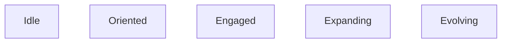
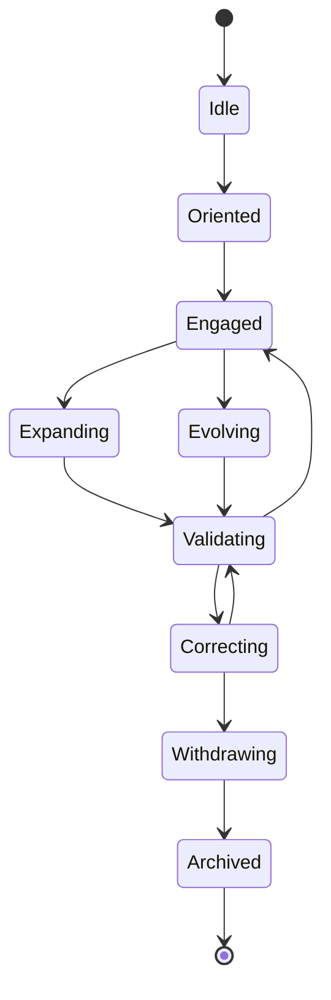

# KWANUS OS — Partner State Machine (PartnerStateMachine)
The complete finite‑state machine defining every partner state, transition, trigger, guard, and action within the KWANUS Operating System.

This document defines:
- partner states  
- state categories  
- entry conditions  
- exit conditions  
- transitions  
- triggers  
- guards  
- actions  
- lifecycle mapping  
- compatibility mapping  
- sustainability mapping  
- ceremonial transitions  

It is the **mechanical backbone** of the partner universe.

---

# 1. State Machine Philosophy

The partner state machine must be:
- deterministic  
- governed  
- ceremonial  
- lifecycle‑aligned  
- compatibility‑aware  
- sustainability‑aware  
- reversible (until EoS)  
- predictable  

No partner may exist outside the state machine.

---

# 2. State Categories

The partner universe contains **nine primary states**, grouped into three categories:

## Category A — Active States

## Category B — Transitional States

## Category C — Terminal States

---

# 3. State Definitions

## 1. Idle  
Partner is connected but inactive.  
Allowed: status updates  
Forbidden: capability requests  

## 2. Oriented  
Partner has received lifecycle + governance context.  
Allowed: capability requests  
Forbidden: expansion  

## 3. Engaged  
Partner is actively interacting with the OS.  
Allowed: workflows, permissions, updates  
Forbidden: tier changes  

## 4. Expanding  
Partner is requesting or integrating new capabilities.  
Allowed: capability integration  
Forbidden: workflow execution  

## 5. Evolving  
Partner is undergoing tier‑level transformation.  
Allowed: intelligence activation  
Forbidden: expansion  

## 6. Validating  
Partner is undergoing compatibility or governance validation.  
Allowed: migration  
Forbidden: expansion, evolution  

## 7. Correcting  
Partner must remediate issues.  
Allowed: remediation  
Forbidden: expansion, evolution  

## 8. Withdrawing  
Partner is in deprecation or EoS.  
Allowed: final updates  
Forbidden: all new capabilities  

## 9. Archived  
Partner is fully removed from the universe.  
Allowed: none  
Forbidden: all interaction  

---

# 4. State Transitions

All transitions are governed.

---

# 5. Transition Triggers

## Idle → Oriented  
Trigger: partner connects  
Guard: compatibility baseline met  

## Oriented → Engaged  
Trigger: partner acknowledges orientation  
Guard: governance alignment  

## Engaged → Expanding  
Trigger: capability request  
Guard: tier compatibility  

## Engaged → Evolving  
Trigger: tier elevation request  
Guard: governance approval  

## Expanding → Validating  
Trigger: capability integration complete  
Guard: compatibility checks  

## Evolving → Validating  
Trigger: tier shift complete  
Guard: lifecycle checks  

## Validating → Engaged  
Trigger: validation success  
Guard: sustainability baseline  

## Validating → Correcting  
Trigger: validation failure  
Guard: remediation required  

## Correcting → Validating  
Trigger: remediation complete  
Guard: governance approval  

## Correcting → Withdrawing  
Trigger: repeated failure  
Guard: SCO escalation  

## Withdrawing → Archived  
Trigger: EoS  
Guard: none  

---

# 6. Guard Conditions

Guards ensure transitions are safe.

## Governance Guards  
- council approval  
- permission boundaries  
- lifecycle alignment  

## Compatibility Guards  
- version alignment  
- runtime alignment  
- workflow alignment  

## Sustainability Guards  
- health thresholds  
- compliance thresholds  

## Ceremony Guards  
- required rites completed  

---

# 7. Actions

Each transition triggers actions.

## Orientation Actions  
- provide lifecycle map  
- provide governance map  

## Engagement Actions  
- enable workflows  
- enable permissions  

## Expansion Actions  
- integrate capabilities  
- update compatibility matrix  

## Evolution Actions  
- shift tier  
- activate intelligence runtime  

## Validation Actions  
- run compatibility checks  
- run governance checks  

## Correction Actions  
- issue remediation plan  
- restrict capabilities  

## Withdrawal Actions  
- disable workflows  
- revoke permissions  

## Archival Actions  
- remove registry entry  
- archive metadata  

---

# 8. Lifecycle Mapping

Lifecycle → State Machine:

- **Active** → Idle / Oriented / Engaged  
- **Maintenance** → Correcting  
- **Deprecation** → Withdrawing  
- **EoS** → Withdrawing → Archived  
- **Post‑EoS** → Archived  

---

# 9. Compatibility Mapping

Compatibility events map to:

- **Version Notice** → Oriented  
- **Fallback Activation** → Engaged  
- **Migration** → Expanding / Validating  
- **Validation** → Validating  
- **Release** → Engaged  

---

# 10. Sustainability Mapping

Sustainability events map to:

- **Health Decline** → Correcting  
- **Health Restoration** → Validating → Engaged  
- **Health Collapse** → Withdrawing  

---

# 11. Ceremonial Transitions

Each transition has a ceremonial marker:

- **Idle → Oriented** = Orientation Glow  
- **Oriented → Engaged** = Activation Pulse  
- **Engaged → Expanding** = Unfolding Motion  
- **Engaged → Evolving** = Rising Light  
- **Expanding → Validating** = Weaving Lock  
- **Evolving → Validating** = Flame Seal  
- **Validating → Engaged** = Renewal Loop  
- **Validating → Correcting** = Dimming Thread  
- **Correcting → Withdrawing** = Waning Crescent  
- **Withdrawing → Archived** = Closing Gate  

---

# 12. Summary

The Partner State Machine provides:
- the states  
- the transitions  
- the triggers  
- the guards  
- the actions  
- the lifecycle mapping  
- the compatibility mapping  
- the sustainability mapping  
- the ceremonial transitions  

…that define the **mechanical structure** of the partner universe.

It is the **state backbone** of the KWANUS OS partner system.
