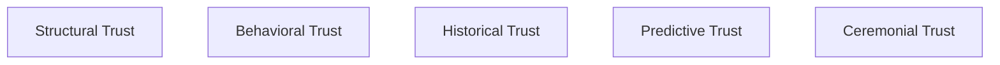
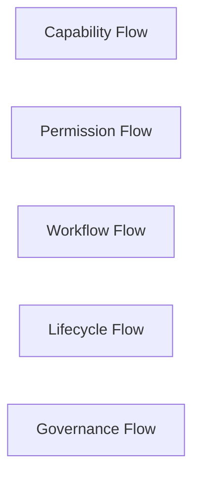
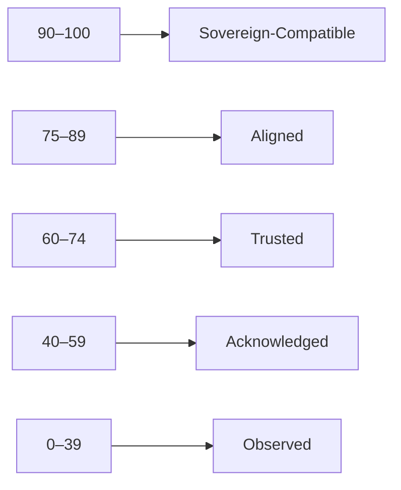

# KWANUS OS — Partner Trust Architecture (PartnerTrustArchitecture)
The complete trust model, trust flows, trust scoring, trust inheritance, and trust-governance framework of the KWANUS Operating System partner universe.

This architecture defines:
- trust philosophy  
- trust categories  
- trust levels  
- trust flows  
- trust scoring  
- trust inheritance  
- trust decay  
- trust restoration  
- trust-based governance  
- trust-based permissions  
- trust-based capabilities  
- trust-based lifecycle transitions  
- ceremonial trust rituals  

It is the **trust backbone** of the partner universe.

---

# 1. Trust Philosophy

Trust in the partner universe must be:
- earned  
- measurable  
- ceremonial  
- emotionally intelligent  
- lifecycle-aware  
- compatibility-aware  
- sustainability-aware  
- reversible  
- governed  

Trust is not assumed — it is **cultivated**.

---

# 2. Trust Categories

The partner universe contains **five trust categories**:

Each category contributes to the partner’s overall trust score.

---

# 3. Trust Levels

Partners exist at one of **five trust levels**:

| Level | Name | Description |
| :--- | :--- | :--- |
| **Level 1** | Observed | Partner is new; trust is minimal. |
| **Level 2** | Acknowledged | Partner has passed basic checks. |
| **Level 3** | Trusted | Partner has demonstrated stability. |
| **Level 4** | Aligned | Partner is deeply integrated. |
| **Level 5** | Sovereign-Compatible | Partner is fully trusted across all dimensions. |

---

# 4. Trust Flows

Trust flows through **five channels**:

Each flow increases or decreases trust depending on partner behavior.

---

# 5. Trust Scoring

Partners receive a **Trust Score** (0–100):

Trust Score determines:
- capability ceilings  
- permission ceilings  
- workflow ceilings  
- intelligence ceilings  
- lifecycle transitions  

---

# 6. Trust Inheritance

Trust is inherited from:

## 1. Historical Behavior  
Past stability increases trust.

## 2. Governance Alignment  
Consistent compliance increases trust.

## 3. Sustainability Health  
High health metrics increase trust.

## 4. Compatibility Success  
Smooth migrations increase trust.

## 5. Ceremonial Completion  
Rites completed increase trust.

Trust inheritance is cumulative.

---

# 7. Trust Decay

Trust decays when:
- permissions drift  
- workflows degrade  
- data violations occur  
- lifecycle steps are skipped  
- sustainability collapses  
- governance is ignored  

Decay is **gradual**, **measurable**, and **reversible**.

---

# 8. Trust Restoration

Trust is restored through:

## 1. Remediation  
Fixing identified issues.

## 2. Validation  
Passing formal checks.

## 3. Renewal  
Completing sustainability cycles.

## 4. Ceremony  
Completing required rites.

## 5. Governance Alignment  
Responding correctly to councils.

---

# 9. Trust-Based Governance

Governance uses trust to determine:
- review frequency  
- audit depth  
- enforcement severity  
- capability access  
- permission access  

**High trust** = fewer restrictions.  
**Low trust** = more oversight.

---

# 10. Trust-Based Permissions & Capabilities

| Trust Level | Permissions | Capabilities |
| :--- | :--- | :--- |
| **Observed** | Read-only | Basic capabilities |
| **Acknowledged** | Limited write | Basic capabilities |
| **Trusted** | Full workflow | Workflow capabilities |
| **Aligned** | Advanced capabilities | Workflow capabilities |
| **Sovereign-Compatible** | Intelligence tier | Intelligence capabilities |

---

# 11. Trust-Based Lifecycle Transitions

Lifecycle transitions require trust:

- **Activation**: Requires trust ≥ 40
- **Expansion**: Requires trust ≥ 60
- **Evolution**: Requires trust ≥ 75
- **Continuity**: Requires trust ≥ 90

---

# 12. Ceremonial Trust Rituals

Trust is ritualized:

- **Trust Rising**: “The flame brightens. Alignment deepens.”
- **Trust Declining**: “The weave loosens. Restore the pattern.”
- **Trust Restored**: “The loom strengthens. Harmony returns.”
- **Trust Sovereign**: “The Compass opens. You stand in full alignment.”

---

# 13. Summary

The Partner Trust Architecture provides the foundation for building, maintaining, and governing trust in the partner universe. It ensures that agency is earned and that the KWANUS OS remains safe and reliable.
